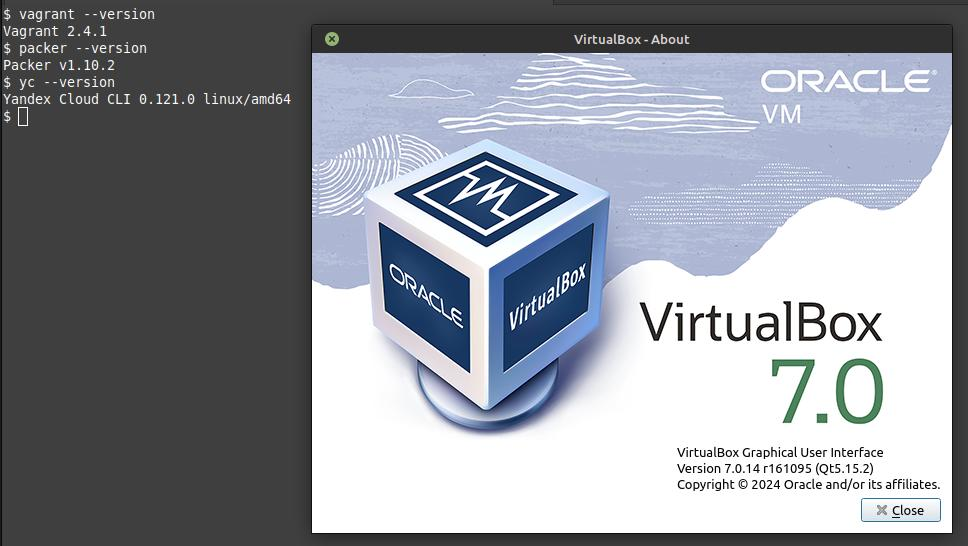

# Домашнее задание к занятию 2. «Применение принципов IaaC в работе с виртуальными машинами»


## Задача 1


> Установите на личный Linux-компьютер или учебную локальную ВМ с Linux следующие сервисы(желательно ОС ubuntu 20.04): VirtualBox, Vagrant, Packer, уandex cloud cli

```shell
vagrant --version
packer --version
yc --version
```



```shell
export VAGRANT_DEFAULT_PROVIDER=virtualbox
### TODO
vagrant box add bento/ubuntu-20.04 --provider=virtualbox --force
```
