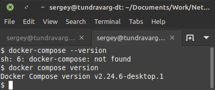
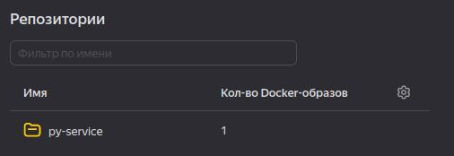
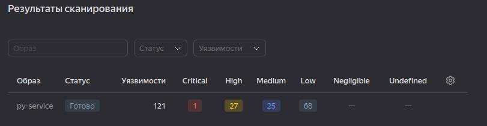
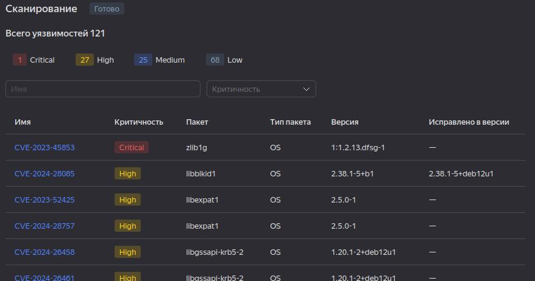
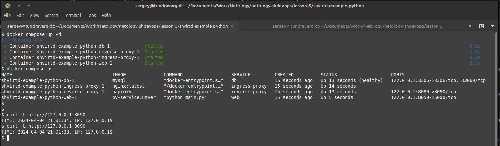
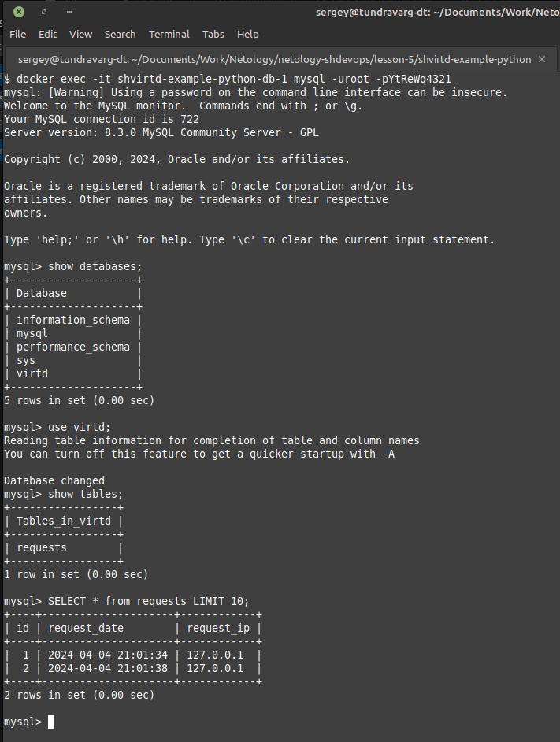
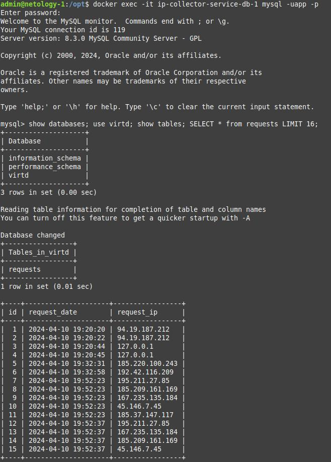
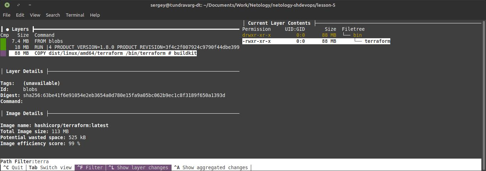
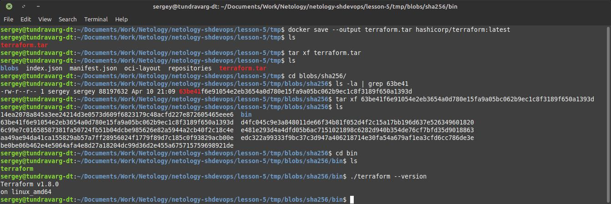
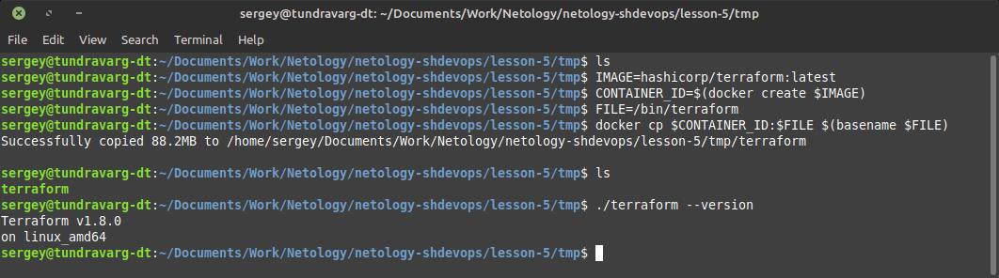

# Домашнее задание к занятию 5. «Практическое применение Docker»


## Задача 0


> Убедитесь что у вас НЕ(!) установлен `docker-compose`.
> Убедитесь что у вас УСТАНОВЛЕН `docker compose` (без тире) версии не менее `v2.24.X`.




## Задача 1


> Сделайте в своем github пространстве fork репозитория ```https://github.com/netology-code/shvirtd-example-python/blob/main/README.md```.

Клон репозиториядобавлен, как подмодуль:
https://github.com/tundravarg/netology-shvirtd-example-python.git .

```shell
git submodule update
```

> Создайте файл с именем Dockerfile.python для сборки данного проекта(для 3 задания изучите https://docs.docker.com/compose/compose-file/build/ ). Используйте базовый образ python:3.9-slim. Протестируйте корректность сборки. Не забудьте dockerignore.

```shell
docker build -f Dockerfile.python -t py-service .
docker run --name mysql -it --rm --env-file .env -p 3306:3306 mysql
docker run --name py-service -it --rm --env-file .env --net host py-service
docker rm -f mysql
```


### venv

```shell
python3 -m venv ./venv/
. ./venv/bin/activate
pip install -r requirements.txt
set -a; . ./.env; set +a
python3 main.py
```

### .env

При использовании `--env-file .env` из значений не удаляются каыфчки.
Поэтому пользователи и пароли в Mysql прописываются, как есть - с кавычками.
И при запуске python приложения они тоже начинают использоваться с кавычками, в результате происходит ошибка синтаксиса SQL-запроса.
Поэтому кавычки были убраны из этого файла.
Кроме того были прописаны пременные для python, чтобы использовать один `.env` файл.

```diff
diff --git a/.env b/.env
index 0406ce6..5fb71a6 100644
--- a/.env
+++ b/.env
@@ -1,5 +1,9 @@
-MYSQL_ROOT_PASSWORD="YtReWq4321"
+MYSQL_ROOT_PASSWORD=YtReWq4321
+MYSQL_DATABASE=virtd
+MYSQL_USER=app
+MYSQL_PASSWORD=QwErTy1234
 
-MYSQL_DATABASE="virtd"
-MYSQL_USER="app"
-MYSQL_PASSWORD="QwErTy1234"
+DB_HOST=127.0.0.1
+DB_NAME=virtd
+DB_USER=app
+DB_PASSWORD=QwErTy1234
```


## Задача 2


### docker login

1. Настроить `yc`: https://yandex.cloud/ru/docs/cli/quickstart#install
2. Создать сервисный аккаунт в Yandex Cloud
3. Получить IAM-токен: `yc iam key create --service-account-name <имя_сервисного_аккаунта> -o key.json`.
4. Залогиниться: `cat key.json | docker login --username json_key --password-stdin cr.yandex`.
    * Если возникает ошибка `ERROR: docker login is not supported with yc credential helper.`
        * https://yandex.cloud/en/docs/container-registry/error/
        * Удалить `cr.yandex` из `${HOME}/.docker/config.json`.
    * **Удалить файл** `key.json`


### Залить образ в Yandex Docker Registry

```shell
docker tag <image-name> cr.yandex/<yandex-registry-id>/<image-name>:<tag>
docker push cr.yandex/<yandex-registry-id>/<image-name>:<tag>
```

```shell
docker tag py-service cr.yandex/crpcmto6rb44nkqde1fn/py-service:0.0.0
docker push cr.yandex/crpcmto6rb44nkqde1fn/py-service:0.0.0
```




### Сканирование





[Отчёт](files/py-service-vulnerabilities.csv)


## Задача 3


Проверка содержимого БД:

```shell
docker exec -it ip-collector-service-db-1 mysql -uapp -p

show databases;
use virtd;
show tables;
SELECT * from requests LIMIT 10;

show databases; use virtd; show tables; SELECT * from requests LIMIT 16;
```






## Задача 5


### Установка Docker

Обновляем пакеты, если Debian-like:

```shell
apt update
apt dist-upgrade
```

Устанавка через скрипт:

```shell
curl -fsSL https://get.docker.com -o get-docker.sh
sudo sh get-docker.sh
```

Проверяем:

```shell
docker version
sudo docker run hello-world
```

Добавляем текущего пользователя в группу `docker`.
Не забываем перелогиниться (перезагрузиться), чтобы группа применилась.

```shell
sudo groupadd docker
sudo usermod -aG docker $(whoami)
```

Проверяем:

```shell
docker run hello-world
```


### Скрипт запуска проекта

* [Скрипт (локальный)](shvirtd-example-python/run-ip-collector.sh)
* [Скрипт (github)](https://github.com/tundravarg/netology-shvirtd-example-python/blob/lesson-5/run-ip-collector.sh)

```shell
#!/bin/bash

REPOSITORY=https://github.com/tundravarg/netology-shvirtd-example-python.git
BRANCH=lesson-5

TARGET=/opt/ip-collector-service

rm -rf $TARGET &&

git clone $REPOSITORY $TARGET &&
cd $TARGET &&
git checkout $BRANCH &&

docker compose create &&
docker compose up &&

echo "Done" || ( echo "Fail"; exit 1 )
```




## Задача 6


> Скачайте docker образ ```hashicorp/terraform:latest``` и скопируйте бинарный файл ```/bin/terraform``` на свою локальную машину, используя dive и docker save.

```shell
IMAGE=hashicorp/terraform:latest
docker pull $IMAGE
DIVE="docker run -ti --rm  -v /var/run/docker.sock:/var/run/docker.sock wagoodman/dive"
$DIVE $IMAGE
```



```shell
docker save --output terraform.tar hashicorp/terraform:latest
tar xf terraform.tar
cd blobs/sha256/
ls -la | grep 63be41
tar xf 63be41f6e91054e2eb3654a0d780e15fa9a05bc062b9ec1c8f3189f650a1393d
cd bin
ls
./terraform --version
```




## Задача 6.1

> Добейтесь аналогичного результата, используя docker cp.

```shell
IMAGE=hashicorp/terraform:latest
CONTAINER_ID=$(docker create $IMAGE)
FILE=/bin/terraform
docker cp $CONTAINER_ID:$FILE $(basename $FILE)
```




```shell
docker build -f Dockerfile.python -t tmp .
```


## Задача 6.2 (**)

> Предложите способ извлечь файл из контейнера, используя только команду docker build и любой Dockerfile.

```shell
docker rm -f tmp && \
    docker build -f Dockerfile.python -t tmp . && \
    TMP_ID=$(docker create --name tmp tmp) && \
    docker cp $TMP_ID:/app/main.py ./out && \
    docker rm $TMP_ID
```


