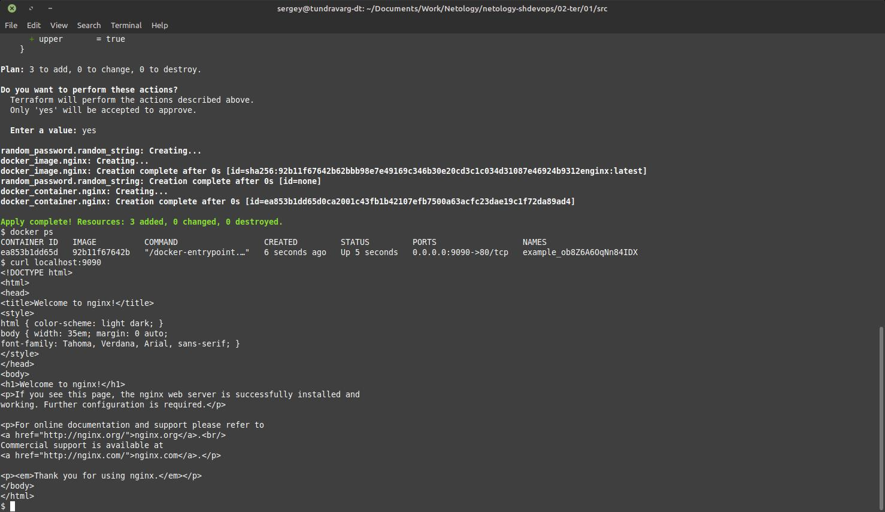
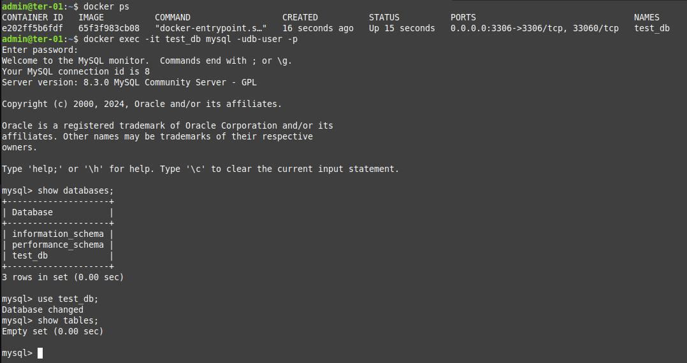

# Домашнее задание к занятию «Введение в Terraform»


## Задание 1


> 1. Скачайте все необходимые зависимости, использованные в проекте.

```shell
# cp .terraformrc ~
terraform init
```


> 2. В каком terraform-файле, согласно этому .gitignore, допустимо сохранить личную, секретную информацию?

По всей видимости, в `personal.auto.tfvars`.

```
# own secret vars store.
personal.auto.tfvars
```


> 3. Выполните код проекта. Найдите в state-файле секретное содержимое созданного ресурса random_password, пришлите в качестве ответа конкретный ключ и его значение.

```shell
terraform apply
```

`"result": "rYfhLsRn39xrtXFs",`


> 4. Раскомментируйте блок кода, примерно расположенный на строчках 29–42 файла main.tf. Выполните команду terraform validate. Объясните, в чём заключаются намеренно допущенные ошибки. Исправьте их.

```shell
terraform validate
```


```diff
diff --git a/02-ter/01/src/main.tf b/02-ter/01/src/main.tf
index 0e29e0d..ae92e24 100644
--- a/02-ter/01/src/main.tf
+++ b/02-ter/01/src/main.tf
@@ -20,19 +20,18 @@ resource "random_password" "random_string" {
   min_numeric = 1
 }
 
-/*
-resource "docker_image" {
+
+resource "docker_image" "nginx" {
   name         = "nginx:latest"
   keep_locally = true
 }
 
-resource "docker_container" "1nginx" {
+resource "docker_container" "nginx" {
   image = docker_image.nginx.image_id
-  name  = "example_${random_password.random_string_FAKE.resulT}"
+  name  = "example_${random_password.random_string.result}"
 
   ports {
     internal = 80
     external = 9090
   }
 }
-*/
```


1. `resource "docker_image" {` - не было указано имя ресурса (`Error: Missing name for resource`).
2. `"1nginx"` - Идентификатор начинается с цифры (`Error: Invalid resource name`).
3. `_FAKE` - Ресурс с указанным идентификатором не найден (`Error: Reference to undeclared resource`).
4. `.resulT` - У ресурса нет такого атрибута (`Error: Unsupported attribute`).


> 5. Выполните код. В качестве ответа приложите: исправленный фрагмент кода и вывод команды docker ps.

```shell
terraform apply
docker ps
```




> 6. Замените имя docker-контейнера в блоке кода на hello_world. Не перепутайте имя контейнера и имя образа. Мы всё ещё продолжаем использовать name = "nginx:latest". Выполните команду terraform apply -auto-approve. Объясните своими словами, в чём может быть опасность применения ключа -auto-approve. Догадайтесь или нагуглите зачем может пригодиться данный ключ? В качестве ответа дополнительно приложите вывод команды docker ps.

```shell
terraform apply -auto-approve
docker ps
```


Без обпции `-auto-approve` выводится diff `terraform.tfstate` и запрос на подтверждение операции применения изменений.
С этой опцией подтверждение не запрашивается и изменения применяются сразу.
Если изменения сделаны человеком только что, то разумно сначала посмотреть, что произойдёт при выполнении конфигурации, чтобы ничего не сломать в целевой среде.
Если же это выполняется в каком-то автоматическом режиме без участия человека, например в среде автоматизации процессов, то этот флаг будет необходим.
В этом случае считаем, что изменения уже пртестированы разработчиком и могут быть применены автоматически.


> 7. Уничтожьте созданные ресурсы с помощью terraform. Убедитесь, что все ресурсы удалены. Приложите содержимое файла terraform.tfstate.

```shell
terraform destroy
docker ps
```


```json
{
  "version": 4,
  "terraform_version": "1.5.7",
  "serial": 18,
  "lineage": "4d93c8e4-97a9-49d0-9aa8-d640c4be754c",
  "outputs": {},
  "resources": [],
  "check_results": null
}
```


> 8. Объясните, почему при этом не был удалён docker-образ nginx:latest. Ответ ОБЯЗАТЕЛЬНО НАЙДИТЕ В ПРЕДОСТАВЛЕННОМ КОДЕ, а затем ОБЯЗАТЕЛЬНО ПОДКРЕПИТЕ строчкой из документации terraform провайдера docker. (ищите в классификаторе resource docker_image)

```hcl
resource "docker_image" "nginx" {
  name         = "nginx:latest"
  keep_locally = true           # <----------------------
}
```

https://docs.comcloud.xyz/providers/calxus/docker/latest/docs/resources/image

> keep_locally (Boolean) If true, then the Docker image won't be deleted on destroy operation. If this is false, it will delete the image from the docker local storage on destroy operation.


## Задание 2*


> 1. Создайте в облаке ВМ. Сделайте это через web-консоль.
> 2. Подключитесь к ВМ по ssh и установите стек docker.

```shell
sudo apt update
sudo apt dist-upgrade

curl -fsSL https://get.docker.com -o get-docker.sh
sudo sh get-docker.sh

docker version
sudo docker run hello-world

sudo groupadd docker
sudo usermod -aG docker $(whoami)

sudo reboot now

docker run hello-world
```


> 3. Найдите в документации docker provider способ настроить подключение terraform на вашей рабочей станции к remote docker context вашей ВМ через ssh.

```hcl
provider "docker" {
  host     = "ssh://user@remote-host:22"
  ssh_opts = ["-o", "StrictHostKeyChecking=no", "-o", "UserKnownHostsFile=/dev/null"]
}
```

> 4. Используя terraform и remote docker context, скачайте и запустите на вашей ВМ контейнер mysql:8 на порту 127.0.0.1:3306, передайте ENV-переменные. Сгенерируйте разные пароли через random_password и передайте их в контейнер, используя интерполяцию из примера с nginx.(name  = "example_${random_password.random_string.result}" , двойные кавычки и фигурные скобки обязательны!)

[main.tf](src-2/main.tf)

```shell
terraform init
terraform validate
terraform apply
```


```shell
cat terraform.tfstate | grep MYSQL_PASSWORD
```

```shell
docker ps
docker exec -it test_db env | grep MYSQL_
docker exec -it test_db mysql -udb-user -p
```




> 5. Зайдите на вашу ВМ , подключитесь к контейнеру и проверьте наличие секретных env-переменных с помощью команды env.


