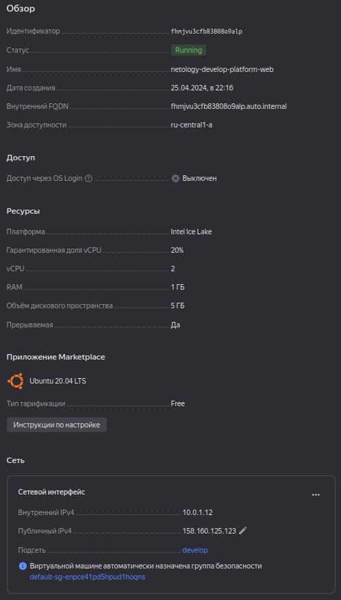
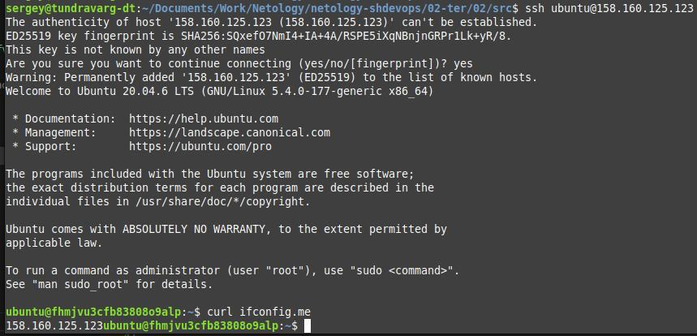
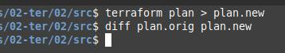
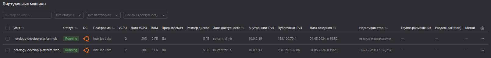
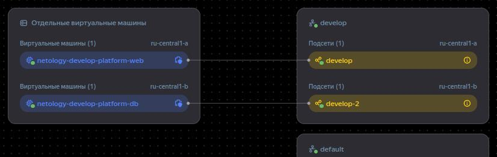
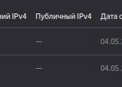
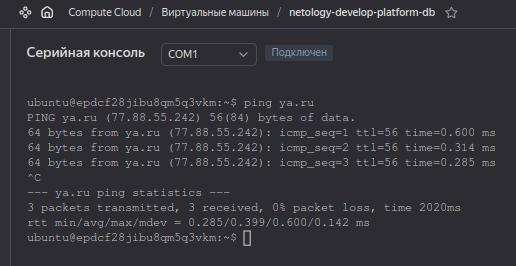

# Домашнее задание к занятию «Основы Terraform. Yandex Cloud»


## Задание 1


> 2. Создайте сервисный аккаунт и ключ.

1. Настроить `yc`: https://yandex.cloud/en/docs/cli/quickstart#install
2. Создать сервисный аккаунт с ролью `admin` в Yandex Cloud (через UI).
3. Получить IAM-токен: https://yandex.cloud/ru/docs/iam/operations/iam-token/create-for-sa
    1. Если профиль ещё не создан:
        1. Создать профиля: `yc config profile create <account-name>`
        2. Создать авторизационного ключа сервисного аккаунта: `yc iam key create --service-account-name <account-name> --output key.json`
        3. Указать ключа для профиля: `yc config set service-account-key key.json`
    2. Получить IAM-токена: `yc iam create-token`


> 3. Сгенерируйте новый или используйте свой текущий ssh-ключ. Запишите его открытую(public) часть в переменную vms_ssh_public_root_key.

```diff
--- a/02-ter/02/src/variables.tf
+++ b/02-ter/02/src/variables.tf
@@ -36,6 +36,5 @@ variable "vpc_name" {
 
 variable "vms_ssh_root_key" {
   type        = string
-  default     = "<your_ssh_ed25519_key>"
   description = "ssh-keygen -t ed25519"
 }
```

И добавил его в `target.auto.tfvars`, как и другие параметры, требующие ручного ввода.
А сам `target.auto.tfvars` - в игнор.


> 4. Инициализируйте проект, выполните код. Исправьте намеренно допущенные синтаксические ошибки. Ищите внимательно, посимвольно. Ответьте, в чём заключается их суть.

```shell
terraform init
terraform validate
terraform plan
terraform apply
terraform destroy
```

1. `FailedPrecondition desc = Platform "standart-v4" not found`

    * Опечатка.
        Нет платформы `standard-v4`, есть `standard-v4` (Intel® Xeon® Gold 6338).
        Платформы перечислены на странице https://yandex.cloud/en/docs/compute/concepts/vm-platforms.
    * `platform_id = "standart-v4"` -> `platform_id = "standard-v3"`

2. `InvalidArgument desc = the specified core fraction is not available on platform "standard-v3"; allowed core fractions: 20, 50, 100`

    * Нет "Гарантированная доля vCPU" `5%`, самая близкая к этому - `20%`.
    * `core_fraction = 5` -> `core_fraction = 20`

3. `InvalidArgument desc = the specified number of cores is not available on platform "standard-v3"; allowed core number: 2, 4`

    * То же самое про количество ядер.
    * `cores = 1` -> `cores = 2`

4. **SUCCESS:** `yandex_compute_instance.platform: Creation complete after 41s [id=fhmg3lk338ocm8f7fho7]`

```diff
--- a/02-ter/02/src/main.tf
+++ b/02-ter/02/src/main.tf
@@ -14,11 +14,11 @@ data "yandex_compute_image" "ubuntu" {
 }
 resource "yandex_compute_instance" "platform" {
   name        = "netology-develop-platform-web"
-  platform_id = "standart-v4"
+  platform_id = "standard-v3"
   resources {
-    cores         = 1
+    cores         = 2
     memory        = 1
-    core_fraction = 5
+    core_fraction = 20
   }
   boot_disk {
     initialize_params {
```



**Заметки**
* https://docs.comcloud.xyz/providers/yandex-cloud/yandex/latest/docs
* https://yandex.cloud/en/docs/compute/concepts/vm


> 5. Подключитесь к консоли ВМ через ssh и выполните команду curl ifconfig.me.




> 6. Ответьте, как в процессе обучения могут пригодиться параметры preemptible = true и core_fraction=5 в параметрах ВМ.

Позволяют сэкономить денежные средства,
если не требуется полная вычислительная можность ВМ.
Например, если эот какой-то тестовый стенд, не требующий высокой вычислительной мощности
или, как в этих занятиях, учебная виртуалка, чтобы "поиграться" с ней.


## Задание 2


> 1. Замените все хардкод-значения для ресурсов yandex_compute_image и yandex_compute_instance на отдельные переменные. К названиям переменных ВМ добавьте в начало префикс vm_web_ . Пример: vm_web_name.
> 2. Объявите нужные переменные в файле variables.tf, обязательно указывайте тип переменной. Заполните их default прежними значениями из main.tf.
> 3. Проверьте terraform plan. Изменений быть не должно.

```shell
terraform plan > plan.orig
# changes...
terraform plan > plan.new
# diff
diff -u plan.orig plan.new
```




```diff
diff --git a/02-ter/02/src/main.tf b/02-ter/02/src/main.tf
index 598a404..5d841ce 100644
--- a/02-ter/02/src/main.tf
+++ b/02-ter/02/src/main.tf
@@ -10,15 +10,16 @@ resource "yandex_vpc_subnet" "develop" {
 
 
 data "yandex_compute_image" "ubuntu" {
-  family = "ubuntu-2004-lts"
+  family = "${var.vm_web_family}"
 }
+
 resource "yandex_compute_instance" "platform" {
-  name        = "netology-develop-platform-web"
-  platform_id = "standard-v3"
+  name        = "${var.vm_web_name}"
+  platform_id = "${var.vm_web_platform_id}"
   resources {
-    cores         = 2
-    memory        = 1
-    core_fraction = 20
+    cores         = var.vm_web_cores
+    memory        = var.vm_web_memory
+    core_fraction = var.vm_web_core_fraction
   }
   boot_disk {
     initialize_params {
@@ -26,16 +27,16 @@ resource "yandex_compute_instance" "platform" {
     }
   }
   scheduling_policy {
-    preemptible = true
+    preemptible = var.vm_web_preemptible
   }
   network_interface {
     subnet_id = yandex_vpc_subnet.develop.id
-    nat       = true
+    nat       = var.vm_web_nat
   }
 
   metadata = {
-    serial-port-enable = 1
-    ssh-keys           = "ubuntu:${var.vms_ssh_root_key}"
+    serial-port-enable = var.vm_web_serial-port-enable
+    ssh-keys           = "${var.vms_ssh_root_user}:${var.vms_ssh_root_key}"
   }
 
 }
diff --git a/02-ter/02/src/variables.tf b/02-ter/02/src/variables.tf
index d56fb1d..d846d57 100644
--- a/02-ter/02/src/variables.tf
+++ b/02-ter/02/src/variables.tf
@@ -34,7 +34,70 @@ variable "vpc_name" {
 
 ###ssh vars
 
+variable "vms_ssh_root_user" {
+  type        = string
+  default     = "ubuntu"
+  description = "Admin's username"
+}
+
 variable "vms_ssh_root_key" {
   type        = string
   description = "ssh-keygen -t ed25519"
 }
+
+
+### VM vars
+
+variable "vm_web_family" {
+  type        = string
+  default     = "ubuntu-2004-lts"
+}
+
+variable "vm_web_name" {
+  type        = string
+  default     = "netology-develop-platform-web"
+}
+
+variable "vm_web_platform_id" {
+  type        = string
+  default     = "standard-v3"
+}
+
+variable "vm_web_cores" {
+  type        = number
+  default     = 2
+}
+
+variable "vm_web_memory" {
+  type        = number
+  default     = 1
+}
+
+variable "vm_web_core_fraction" {
+  type        = number
+  default     = 20
+}
+
+variable "vm_web_preemptible" {
+  type        = bool
+  default     = true
+}
+
+variable "vm_web_nat" {
+  type        = bool
+  default     = true
+}
+
+variable "vm_web_serial-port-enable" {
+  type        = number
+  default     = 1
+}
```


## Задание 3


> 1. Создайте в корне проекта файл 'vms_platform.tf' . Перенесите в него все переменные первой ВМ.
> 2. Скопируйте блок ресурса и создайте с его помощью вторую ВМ в файле main.tf: **"netology-develop-platform-db"** ,  ```cores  = 2, memory = 2, core_fraction = 20```. Объявите её переменные с префиксом **vm_db_** в том же файле ('vms_platform.tf').  ВМ должна работать в зоне "ru-central1-b"
> 3. Примените изменения.

```diff
diff --git a/02-ter/02/src/main.tf b/02-ter/02/src/main.tf
index 5d841ce..7ee489e 100644
--- a/02-ter/02/src/main.tf
+++ b/02-ter/02/src/main.tf
@@ -1,19 +1,26 @@
 resource "yandex_vpc_network" "develop" {
   name = var.vpc_name
 }
+
 resource "yandex_vpc_subnet" "develop" {
-  name           = var.vpc_name
+  name           = var.default_subnet_name
   zone           = var.default_zone
   network_id     = yandex_vpc_network.develop.id
   v4_cidr_blocks = var.default_cidr
 }
+resource "yandex_vpc_subnet" "develop-2" {
+  name           = var.develop-2_subnet_name
+  zone           = var.develop-2_zone
+  network_id     = yandex_vpc_network.develop.id
+  v4_cidr_blocks = var.develop-2_cidr
+}
 
 
-data "yandex_compute_image" "ubuntu" {
+data "yandex_compute_image" "image-web" {
   family = "${var.vm_web_family}"
 }
 
-resource "yandex_compute_instance" "platform" {
+resource "yandex_compute_instance" "platform-web" {
   name        = "${var.vm_web_name}"
   platform_id = "${var.vm_web_platform_id}"
   resources {
@@ -23,7 +30,7 @@ resource "yandex_compute_instance" "platform" {
   }
   boot_disk {
     initialize_params {
-      image_id = data.yandex_compute_image.ubuntu.image_id
+      image_id = data.yandex_compute_image.image-web.image_id
     }
   }
   scheduling_policy {
@@ -33,10 +40,40 @@ resource "yandex_compute_instance" "platform" {
     subnet_id = yandex_vpc_subnet.develop.id
     nat       = var.vm_web_nat
   }
-
   metadata = {
     serial-port-enable = var.vm_web_serial-port-enable
     ssh-keys           = "${var.vms_ssh_root_user}:${var.vms_ssh_root_key}"
   }
+}
+
 
+data "yandex_compute_image" "image-db" {
+  family = "${var.vm_db_family}"
+}
+
+resource "yandex_compute_instance" "platform-db" {
+  name        = "${var.vm_db_name}"
+  platform_id = "${var.vm_db_platform_id}"
+  zone        = "${var.vm_db_zone}"
+  resources {
+    cores         = var.vm_db_cores
+    memory        = var.vm_db_memory
+    core_fraction = var.vm_db_core_fraction
+  }
+  boot_disk {
+    initialize_params {
+      image_id = data.yandex_compute_image.image-db.image_id
+    }
+  }
+  scheduling_policy {
+    preemptible = var.vm_db_preemptible
+  }
+  network_interface {
+    subnet_id = yandex_vpc_subnet.develop-2.id
+    nat       = var.vm_db_nat
+  }
+  metadata = {
+    serial-port-enable = var.vm_db_serial-port-enable
+    ssh-keys           = "${var.vms_ssh_root_user}:${var.vms_ssh_root_key}"
+  }
 }
```






### Задание 4


> 1. Объявите в файле outputs.tf **один** output , содержащий: instance_name, external_ip, fqdn для каждой из ВМ в удобном лично для вас формате.

```tf
output "test" {

    description = "VMs"

    value = {
        platform-web = {
            instance_name = yandex_compute_instance.platform-web.name,
            external_ip = yandex_compute_instance.platform-web.network_interface[0].nat_ip_address,
            fqdn = yandex_compute_instance.platform-web.fqdn
        },
        platform-db = {
            instance_name = yandex_compute_instance.platform-db.name,
            external_ip = yandex_compute_instance.platform-db.network_interface[0].nat_ip_address,
            fqdn = yandex_compute_instance.platform-db.fqdn
        }
    }

}
```

Вывод:

```
terraform apply
...

Apply complete! Resources: 0 added, 0 changed, 0 destroyed.

Outputs:

test = {
  "platform-db" = {
    "external_ip" = "158.160.70.4"
    "fqdn" = "epdcf28jibu8qm5q3vkm.auto.internal"
    "instance_name" = "netology-develop-platform-db"
  }
  "platform-web" = {
    "external_ip" = "158.160.102.66"
    "fqdn" = "fhmvlsod51ft7df4g25a.auto.internal"
    "instance_name" = "netology-develop-platform-web"
  }
}
```


### Задание 5


> 1. В файле locals.tf опишите в **одном** local-блоке имя каждой ВМ, используйте интерполяцию ${..} с НЕСКОЛЬКИМИ переменными по примеру из лекции.
> 2. Замените переменные внутри ресурса ВМ на созданные вами local-переменные.

```diff
diff --git a/02-ter/02/src/locals.tf b/02-ter/02/src/locals.tf
index e69de29..781eebd 100644
--- a/02-ter/02/src/locals.tf
+++ b/02-ter/02/src/locals.tf
@@ -0,0 +1,4 @@
+locals {
+    vm_web_name = "${var.project_name}-${var.environment}-web"
+    vm_db_name  = "${var.project_name}-${var.environment}-db"
+}
\ No newline at end of file
diff --git a/02-ter/02/src/main.tf b/02-ter/02/src/main.tf
index 7ee489e..04627b0 100644
--- a/02-ter/02/src/main.tf
+++ b/02-ter/02/src/main.tf
@@ -21,7 +21,7 @@ data "yandex_compute_image" "image-web" {
 }
 
 resource "yandex_compute_instance" "platform-web" {
-  name        = "${var.vm_web_name}"
+  name        = "${local.vm_web_name}"
   platform_id = "${var.vm_web_platform_id}"
   resources {
     cores         = var.vm_web_cores
@@ -52,7 +52,7 @@ data "yandex_compute_image" "image-db" {
 }
 
 resource "yandex_compute_instance" "platform-db" {
-  name        = "${var.vm_db_name}"
+  name        = "${local.vm_db_name}"
   platform_id = "${var.vm_db_platform_id}"
   zone        = "${var.vm_db_zone}"
   resources {
diff --git a/02-ter/02/src/variables.tf b/02-ter/02/src/variables.tf
index bd25b6f..8acb08b 100644
--- a/02-ter/02/src/variables.tf
+++ b/02-ter/02/src/variables.tf
@@ -1,3 +1,16 @@
+### Project vars
+
+variable "project_name" {
+  type    = string
+  default = "netology"
+}
+
+variable "environment" {
+  type    = string
+  default = "develop-platform"
+}
+
+
 ### Cloud vars
 
 variable "token" {
```

```shell
terraform apply -var="project_name=tuman" -var="environment=test"
```

```
$ terraform apply -var="project_name=tuman" -var="environment=test"
data.yandex_compute_image.image-web: Reading...
data.yandex_compute_image.image-db: Reading...
yandex_vpc_network.develop: Refreshing state... [id=enpik8elbvgttkdjfhhs]
data.yandex_compute_image.image-db: Read complete after 1s [id=fd8cnj92ad0th7m7krqh]
data.yandex_compute_image.image-web: Read complete after 1s [id=fd8cnj92ad0th7m7krqh]
yandex_vpc_subnet.develop: Refreshing state... [id=e9bfnfnjt1k2f6oir4im]
yandex_vpc_subnet.develop-2: Refreshing state... [id=e2la684j0jtgbdttf02j]
yandex_compute_instance.platform-web: Refreshing state... [id=fhmvlsod51ft7df4g25a]
yandex_compute_instance.platform-db: Refreshing state... [id=epdcf28jibu8qm5q3vkm]

Terraform used the selected providers to generate the following execution plan. Resource actions are indicated with the following symbols:
  ~ update in-place

Terraform will perform the following actions:

  # yandex_compute_instance.platform-db will be updated in-place
  ~ resource "yandex_compute_instance" "platform-db" {
        id                        = "epdcf28jibu8qm5q3vkm"
      ~ name                      = "netology-develop-platform-db" -> "tuman-test-db"
        # (9 unchanged attributes hidden)

        # (6 unchanged blocks hidden)
    }

  # yandex_compute_instance.platform-web will be updated in-place
  ~ resource "yandex_compute_instance" "platform-web" {
        id                        = "fhmvlsod51ft7df4g25a"
      ~ name                      = "netology-develop-platform-web" -> "tuman-test-web"
        # (9 unchanged attributes hidden)

        # (6 unchanged blocks hidden)
    }

Plan: 0 to add, 2 to change, 0 to destroy.

Changes to Outputs:
  ~ test = {
      ~ platform-db  = {
          ~ instance_name = "netology-develop-platform-db" -> "tuman-test-db"
            # (2 unchanged attributes hidden)
        }
      ~ platform-web = {
          ~ instance_name = "netology-develop-platform-web" -> "tuman-test-web"
            # (2 unchanged attributes hidden)
        }
    }

Do you want to perform these actions?
```


### Задание 6


> 1. Вместо использования трёх переменных  ".._cores",".._memory",".._core_fraction" в блоке  resources {...}, объедините их в единую map-переменную **vms_resources** и  внутри неё конфиги обеих ВМ в виде вложенного map.
> 3. Создайте и используйте отдельную map переменную для блока metadata, она должна быть общая для всех ваших ВМ.
> 5. Найдите и закоментируйте все, более не используемые переменные проекта.
> 6. Проверьте terraform plan. Изменений быть не должно.

```diff
diff --git a/02-ter/02/src/main.tf b/02-ter/02/src/main.tf
index 04627b0..b16d9da 100644
--- a/02-ter/02/src/main.tf
+++ b/02-ter/02/src/main.tf
@@ -24,9 +24,9 @@ resource "yandex_compute_instance" "platform-web" {
   name        = "${local.vm_web_name}"
   platform_id = "${var.vm_web_platform_id}"
   resources {
-    cores         = var.vm_web_cores
-    memory        = var.vm_web_memory
-    core_fraction = var.vm_web_core_fraction
+    cores         = var.vms_resources.web.cores
+    memory        = var.vms_resources.web.memory
+    core_fraction = var.vms_resources.web.core_fraction
   }
   boot_disk {
     initialize_params {
@@ -40,10 +40,7 @@ resource "yandex_compute_instance" "platform-web" {
     subnet_id = yandex_vpc_subnet.develop.id
     nat       = var.vm_web_nat
   }
-  metadata = {
-    serial-port-enable = var.vm_web_serial-port-enable
-    ssh-keys           = "${var.vms_ssh_root_user}:${var.vms_ssh_root_key}"
-  }
+  metadata = var.vms_metadata
 }
 
 
@@ -56,9 +53,9 @@ resource "yandex_compute_instance" "platform-db" {
   platform_id = "${var.vm_db_platform_id}"
   zone        = "${var.vm_db_zone}"
   resources {
-    cores         = var.vm_db_cores
-    memory        = var.vm_db_memory
-    core_fraction = var.vm_db_core_fraction
+    cores         = var.vms_resources.db.cores
+    memory        = var.vms_resources.db.memory
+    core_fraction = var.vms_resources.db.core_fraction
   }
   boot_disk {
     initialize_params {
@@ -72,8 +69,5 @@ resource "yandex_compute_instance" "platform-db" {
     subnet_id = yandex_vpc_subnet.develop-2.id
     nat       = var.vm_db_nat
   }
-  metadata = {
-    serial-port-enable = var.vm_db_serial-port-enable
-    ssh-keys           = "${var.vms_ssh_root_user}:${var.vms_ssh_root_key}"
-  }
+  metadata = var.vms_metadata
 }
diff --git a/02-ter/02/src/terraform.tfvars b/02-ter/02/src/terraform.tfvars
new file mode 100644
index 0000000..530c877
--- /dev/null
+++ b/02-ter/02/src/terraform.tfvars
@@ -0,0 +1,17 @@
+vms_metadata = {
+  serial-port-enable = 1
+  ssh-keys           = "ubuntu:ssh-rsa AAAAB3NzaC1yc2EAAAADAQABAAABgQDkF/OgffkLTOiBBsiXYEGcfHAWffmJgfJ5dF51ApukgBjtWRJtNDBKg7jlSrX26DP/mi4sN7P1A4QrMqtNlT6qIjXcx306PZ8z19EvHhzK04+ntr3hIvdm+DfzbaFi0zId07bac53UzRx0LnftMpOI+0L7ywnv4YySZFJvmbJsj3DIIjoRYAGqeOFubXx5jYDB+26GQWZXLel36H/6sY5Jye5gmnYQcwfUlMTYdLpR1Whb3O6ORRGVVbX47c28/byWdsAYjePFS9wJLywXjrEDSAjP3pvQTSYQehb80z2SQ53zxEh97xsG+tyS7ipoI6r/XtFhhBrLizRchMIiAQQpggmWnBzpdot+iwGKeuBp9p34QIwKoWFVm/Y9mh6IZGWV9H2xi/RznLHjHwsZU77HwA4+uN2uN/Z6zmBasqONfac0hH7OXmSB2jG3ae2AFTLx/yFqPObyg+HDcz2IrhqREhbV9JRVBhzB2PMu5DahoM0QKa82qjjqbk8ochmObRs= sergey@tundravarg-dt"
+}
+
+vms_resources = {
+    web = {
+        cores         = 2
+        memory        = 1
+        core_fraction = 20
+    }
+    db = {
+        cores         = 2
+        memory        = 2
+        core_fraction = 20
+    }
+}
diff --git a/02-ter/02/src/variables.tf b/02-ter/02/src/variables.tf
index 8acb08b..08492ed 100644
--- a/02-ter/02/src/variables.tf
+++ b/02-ter/02/src/variables.tf
@@ -67,13 +67,7 @@ variable "develop-2_subnet_name" {
 
 ### SSH vars
 
-variable "vms_ssh_root_user" {
-  type        = string
-  default     = "ubuntu"
-  description = "Admin's username"
-}
-
-variable "vms_ssh_root_key" {
-  type        = string
-  description = "ssh-keygen -t ed25519"
+variable "vms_metadata" {
+  description = "Metadata of VM"
+  type        = map
 }
diff --git a/02-ter/02/src/vms_platform.tf b/02-ter/02/src/vms_platform.tf
index 9c7c15f..f9aec8f 100644
--- a/02-ter/02/src/vms_platform.tf
+++ b/02-ter/02/src/vms_platform.tf
@@ -1,3 +1,12 @@
+###### COMMON ####
+
+variable "vms_resources" {
+  description = "Default VM resources"
+  type        = map(any)
+}
+
+
+
 ###### VM WEB ####
 
 ### Image vars
@@ -19,21 +28,6 @@ variable "vm_web_platform_id" {
   default     = "standard-v3"
 }
 
-variable "vm_web_cores" {
-  type        = number
-  default     = 2
-}
-
-variable "vm_web_memory" {
-  type        = number
-  default     = 1
-}
-
-variable "vm_web_core_fraction" {
-  type        = number
-  default     = 20
-}
-
 variable "vm_web_preemptible" {
   type        = bool
   default     = true
@@ -44,11 +38,6 @@ variable "vm_web_nat" {
   default     = true
 }
 
-variable "vm_web_serial-port-enable" {
-  type        = number
-  default     = 1
-}
-
 
 
 
@@ -81,24 +70,6 @@ variable "vm_db_zone" {
   description = ""
 }
 
-variable "vm_db_cores" {
-  type        = number
-  default     = 2
-  description = ""
-}
-
-variable "vm_db_memory" {
-  type        = number
-  default     = 2
-  description = ""
-}
-
-variable "vm_db_core_fraction" {
-  type        = number
-  default     = 20
-  description = ""
-}
-
 variable "vm_db_preemptible" {
   type        = bool
   default     = true
@@ -110,9 +81,3 @@ variable "vm_db_nat" {
   default     = true
   description = ""
 }
-
-variable "vm_db_serial-port-enable" {
-  type        = number
-  default     = 1
-  description = ""
-}
```

```
$ terraform plan
data.yandex_compute_image.image-db: Reading...
data.yandex_compute_image.image-web: Reading...
yandex_vpc_network.develop: Refreshing state... [id=enpik8elbvgttkdjfhhs]
data.yandex_compute_image.image-db: Read complete after 0s [id=fd8cnj92ad0th7m7krqh]
data.yandex_compute_image.image-web: Read complete after 0s [id=fd8cnj92ad0th7m7krqh]
yandex_vpc_subnet.develop: Refreshing state... [id=e9bfnfnjt1k2f6oir4im]
yandex_vpc_subnet.develop-2: Refreshing state... [id=e2la684j0jtgbdttf02j]
yandex_compute_instance.platform-db: Refreshing state... [id=epdcf28jibu8qm5q3vkm]
yandex_compute_instance.platform-web: Refreshing state... [id=fhmvlsod51ft7df4g25a]

No changes. Your infrastructure matches the configuration.

Terraform has compared your real infrastructure against your configuration and found no differences, so no changes are needed.
```


### Задание 7*


> 1. Напишите, какой командой можно отобразить **второй** элемент списка test_list.

```
> local.test_list[1]
"staging"
```

> 2. Найдите длину списка test_list с помощью функции length(<имя переменной>).

```
> length(local.test_list)
3
```

> 3. Напишите, какой командой можно отобразить значение ключа admin из map test_map.

```
> local.test_map["admin"]
"John"
```

> 4. Напишите interpolation-выражение, результатом которого будет: "John is admin for production server based on OS ubuntu-20-04 with X vcpu, Y ram and Z virtual disks", используйте данные из переменных test_list, test_map, servers и функцию length() для подстановки значений.

```
> "John is ${keys(local.test_map)[index(values(local.test_map), "John")]} for production server based on OS ${local.servers["production"]["image"]} with ${local.servers["production"]["cpu"]} vcpu, ${local.servers["production"]["ram"]} ram and ${length(local.servers["production"]["disks"])} virtual disks"
"John is admin for production server based on OS ubuntu-20-04 with 10 vcpu, 40 ram and 4 virtual disks"
```


### Задание 8*


> 1. Напишите и проверьте переменную test и полное описание ее type в соответствии со значением из terraform.tfvars:

```
test = [
  {
    "dev1" = [
      "ssh -o 'StrictHostKeyChecking=no' ubuntu@62.84.124.117",
      "10.0.1.7",
    ]
  },
  {
    "dev2" = [
      "ssh -o 'StrictHostKeyChecking=no' ubuntu@84.252.140.88",
      "10.0.2.29",
    ]
  },
  {
    "prod1" = [
      "ssh -o 'StrictHostKeyChecking=no' ubuntu@51.250.2.101",
      "10.0.1.30",
    ]
  },
]
```

```
variable "test" {
  description = "Variable for task-8"
  type = list(map(list(string)))
}
```

> 2. Напишите выражение в terraform console, которое позволит вычленить строку "ssh -o 'StrictHostKeyChecking=no' ubuntu@62.84.124.117"

```
> var.test[0]["dev1"][0]
"ssh -o 'StrictHostKeyChecking=no' ubuntu@62.84.124.117"
```


### Задание 9*


> Для подключения предварительно через ssh измените пароль пользователя: ```sudo passwd ubuntu```

```
ssh ubuntu@84.252.131.47
sudo passwd ubuntu
exit

ssh ubuntu@51.250.26.107
sudo passwd ubuntu
exit
```

> Используя инструкцию https://cloud.yandex.ru/ru/docs/vpc/operations/create-nat-gateway#tf_1, настройте для ваших ВМ nat_gateway.

```diff
diff --git a/02-ter/02/src/main.tf b/02-ter/02/src/main.tf
index b16d9da..d0aa889 100644
--- a/02-ter/02/src/main.tf
+++ b/02-ter/02/src/main.tf
@@ -7,12 +7,29 @@ resource "yandex_vpc_subnet" "develop" {
   zone           = var.default_zone
   network_id     = yandex_vpc_network.develop.id
   v4_cidr_blocks = var.default_cidr
+  route_table_id = yandex_vpc_route_table.rt.id
 }
 resource "yandex_vpc_subnet" "develop-2" {
   name           = var.develop-2_subnet_name
   zone           = var.develop-2_zone
   network_id     = yandex_vpc_network.develop.id
   v4_cidr_blocks = var.develop-2_cidr
+  route_table_id = yandex_vpc_route_table.rt.id
+}
+
+
+resource "yandex_vpc_gateway" "nat_gateway" {
+  name = "test-gateway"
+  shared_egress_gateway {}
+}
+resource "yandex_vpc_route_table" "rt" {
+  name       = "test-route-table"
+  network_id = yandex_vpc_network.develop.id
+
+  static_route {
+    destination_prefix = "0.0.0.0/0"
+    gateway_id         = yandex_vpc_gateway.nat_gateway.id
+  }
 }
 
 
diff --git a/02-ter/02/src/vms_platform.tf b/02-ter/02/src/vms_platform.tf
index f9aec8f..90ab194 100644
--- a/02-ter/02/src/vms_platform.tf
+++ b/02-ter/02/src/vms_platform.tf
@@ -35,7 +35,7 @@ variable "vm_web_preemptible" {
 
 variable "vm_web_nat" {
   type        = bool
-  default     = true
+  default     = false
 }
 
 
@@ -78,6 +78,6 @@ variable "vm_db_preemptible" {
 
 variable "vm_db_nat" {
   type        = bool
-  default     = true
+  default     = false
   description = ""
 }
```

> Для проверки уберите внешний IP адрес (nat=false) у ваших ВМ и проверьте доступ в интернет с ВМ, подключившись к ней через serial console.



