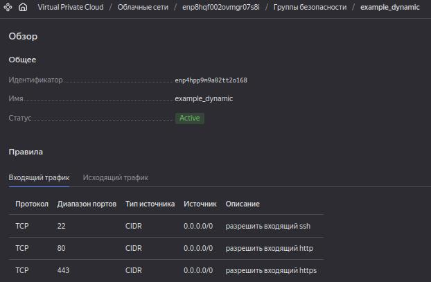
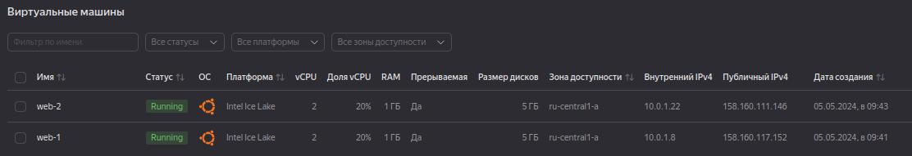
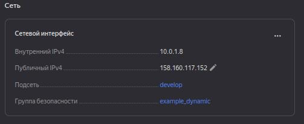
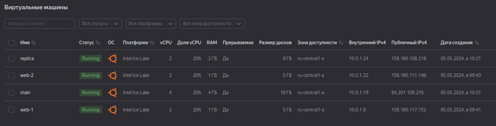
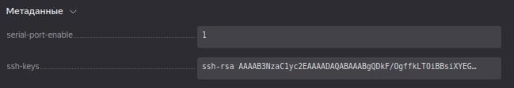

# Домашнее задание к занятию «Управляющие конструкции в коде Terraform»


## Задание 1


> 2. Заполните файл personal.auto.tfvars.

Поля `cloud_id` и `folder_id` заполнил значениями из UI Yandex Cloud.

Вместо заполнения поля `token`, сгенерировал IAM-ключ,
скопировал его куда-то в домашний каталог и
прописал его в `providers.tf`.

Создание токена:

```shell
yc iam key create --service-account-name <имя_сервисного_аккаунта> -o key.json
```

providers.tf:

```conf
provider "yandex" {
#  token     = var.token
  service_account_key_file = file("~/.config/yandex-cloud/.iam_key.json")
```

> 3. Инициализируйте проект, выполните код.

```shell
terraform init
terraform apply
```




## Задание 2


> 1. Создайте файл count-vm.tf. Опишите в нём создание двух **одинаковых** ВМ  web-1 и web-2 (не web-0 и web-1) с минимальными параметрами, используя мета-аргумент **count loop**. Назначьте ВМ созданную в первом задании группу безопасности.

https://docs.comcloud.xyz/providers/yandex-cloud/yandex/latest/docs

```conf
variable "default_metadata" {
  description = "Metadata of VM"
  type        = map
}

data "yandex_compute_image" "default_image" {
  family = "ubuntu-2004-lts"
}

resource "yandex_compute_instance" "count" {
    count = 2

    name = "web-${count.index + 1}"
    platform_id = "standard-v3"
    resources {
        cores = 2
        memory = 1
        core_fraction = 20
    }
    boot_disk {
        initialize_params {
            image_id = data.yandex_compute_image.default_image.image_id
        }
    }
    scheduling_policy {
        preemptible = true
    }
    network_interface {
        subnet_id = yandex_vpc_subnet.develop.id
        security_group_ids = [
            yandex_vpc_security_group.example.id
        ]
        nat = true
    }
    metadata = var.default_metadata
}
```

**NOTE:** Комментарий к коду:
Артефакты в разных файлах. 
Здесь - хардкод значений, т.к., считаю, нет смысла усложнять на данном этапе, суть задания не в этом.






> 2. Создайте файл for_each-vm.tf. Опишите в нём создание двух ВМ для баз данных с именами "main" и "replica" **разных** по cpu/ram/disk_volume , используя мета-аргумент **for_each loop**.

```conf
variable "each_vm" {
    type = map(object({ 
        cpu = number, 
        ram = number,
        disk_volume = number
    }))
    default = {
        "main" = {
            cpu = 4
            ram = 4
            disk_volume = 16
        },
        "replica" = {
            cpu = 2
            ram = 2
            disk_volume = 8
        }
    }
}

resource "yandex_compute_instance" "foreach" {
    for_each = var.each_vm

    name = "${each.key}"
    platform_id = "standard-v3"
    resources {
        cores = each.value.cpu
        memory = each.value.ram
        core_fraction = 20
    }
    boot_disk {
        initialize_params {
            image_id = data.yandex_compute_image.default_image.image_id
            size = each.value.disk_volume
        }
    }
    scheduling_policy {
        preemptible = true
    }
    network_interface {
        subnet_id = yandex_vpc_subnet.develop.id
        security_group_ids = [
            yandex_vpc_security_group.example.id
        ]
        nat = true
    }
    metadata = var.default_metadata
}
```

**NOTE:**
    Использовать предложенный в задании тип переменной не получилось по причине ошибки
    `"for_each" supports maps and sets of strings, but you have provided a set containing type object.`.
    Поэтому тип был заменён на `map(object)`.




> 4. ВМ из пункта 2.1 должны создаваться после создания ВМ из пункта 2.2.

Без указания `depends_on`:

```log
yandex_compute_instance.count[0]: Creating...
yandex_compute_instance.foreach["replica"]: Creating...
yandex_compute_instance.count[1]: Creating...
yandex_compute_instance.foreach["main"]: Creating...
...
```

```diff
--- a/02-ter/03/src/count-vm.tf
+++ b/02-ter/03/src/count-vm.tf
@@ -1,5 +1,6 @@
 resource "yandex_compute_instance" "count" {
     count = 2
+    depends_on = [ yandex_compute_instance.foreach ]
 
     name = "web-${count.index + 1}"
     platform_id = "standard-v3"
```

После указания `depends_on`:

```log
yandex_compute_instance.foreach["main"]: Creating...
yandex_compute_instance.foreach["replica"]: Creating...
yandex_compute_instance.foreach["replica"]: Still creating... [10s elapsed]
yandex_compute_instance.foreach["main"]: Still creating... [10s elapsed]
yandex_compute_instance.foreach["main"]: Still creating... [20s elapsed]
yandex_compute_instance.foreach["replica"]: Still creating... [20s elapsed]
yandex_compute_instance.foreach["main"]: Still creating... [30s elapsed]
yandex_compute_instance.foreach["replica"]: Still creating... [30s elapsed]
yandex_compute_instance.foreach["main"]: Creation complete after 40s [id=fhmrs33mfrt9qi3qm3b9]
yandex_compute_instance.foreach["replica"]: Still creating... [40s elapsed]
yandex_compute_instance.foreach["replica"]: Creation complete after 40s [id=fhmo9ejok1ceg3r1ejoq]
yandex_compute_instance.count[0]: Creating...
yandex_compute_instance.count[1]: Creating...
...
```

> 5. Используйте функцию file в local-переменной для считывания ключа ~/.ssh/id_rsa.pub и его последующего использования в блоке metadata, взятому из ДЗ 2.

```diff
diff --git a/02-ter/03/src/count-vm.tf b/02-ter/03/src/count-vm.tf
index 69e357c..319d13a 100644
--- a/02-ter/03/src/count-vm.tf
+++ b/02-ter/03/src/count-vm.tf
@@ -24,5 +24,5 @@ resource "yandex_compute_instance" "count" {
         ]
         nat = true
     }
-    metadata = var.default_metadata
+    metadata = local.default_metadata
 }

diff --git a/02-ter/03/src/for_each-vm.tf b/02-ter/03/src/for_each-vm.tf
index 12ea33f..fb77db2 100644
--- a/02-ter/03/src/for_each-vm.tf
+++ b/02-ter/03/src/for_each-vm.tf
@@ -45,5 +45,5 @@ resource "yandex_compute_instance" "foreach" {
         ]
         nat = true
     }
-    metadata = var.default_metadata
+    metadata = local.default_metadata
 }

diff --git a/02-ter/03/src/locals.tf b/02-ter/03/src/locals.tf
new file mode 100644
index 0000000..96bbb11
--- /dev/null
+++ b/02-ter/03/src/locals.tf
@@ -0,0 +1,8 @@
+### SSH
+
+locals {
+    default_metadata = {
+        serial-port-enable = 1
+        ssh-keys = file(var.default_ssh_pub_key_file)
+    }
+}

diff --git a/02-ter/03/src/terraform.tfvars b/02-ter/03/src/terraform.tfvars
index f2e2c32..e69de29 100644
--- a/02-ter/03/src/terraform.tfvars
+++ b/02-ter/03/src/terraform.tfvars
@@ -1,4 +0,0 @@
-default_metadata = {
-  serial-port-enable = 1
-  ssh-keys           = "ubuntu:ssh-rsa AAAAB3NzaC1yc2EAAAADAQABAAABgQDkF/OgffkLTOiBBsiXYEGcfHAWffmJgfJ5dF51ApukgBjtWRJtNDBKg7jlSrX26DP/mi4sN7P1A4QrMqtNlT6qIjXcx306PZ8z19EvHhzK04+ntr3hIvdm+DfzbaFi0zId07bac53UzRx0LnftMpOI+0L7ywnv4YySZFJvmbJsj3DIIjoRYAGqeOFubXx5jYDB+26GQWZXLel36H/6sY5Jye5gmnYQcwfUlMTYdLpR1Whb3O6ORRGVVbX47c28/byWdsAYjePFS9wJLywXjrEDSAjP3pvQTSYQehb80z2SQ53zxEh97xsG+tyS7ipoI6r/XtFhhBrLizRchMIiAQQpggmWnBzpdot+iwGKeuBp9p34QIwKoWFVm/Y9mh6IZGWV9H2xi/RznLHjHwsZU77HwA4+uN2uN/Z6zmBasqONfac0hH7OXmSB2jG3ae2AFTLx/yFqPObyg+HDcz2IrhqREhbV9JRVBhzB2PMu5DahoM0QKa82qjjqbk8ochmObRs= sergey@tundravarg-dt"
-}
\ No newline at end of file

diff --git a/02-ter/03/src/variables.tf b/02-ter/03/src/variables.tf
index f8d83a2..b387cb1 100644
--- a/02-ter/03/src/variables.tf
+++ b/02-ter/03/src/variables.tf
@@ -32,10 +32,10 @@ variable "vpc_name" {
 }
 
 
-
 ### SSH
 
-variable "default_metadata" {
-  description = "Metadata of VM"
-  type        = map
-}
\ No newline at end of file
+variable "default_ssh_pub_key_file" {
+    description = "Path to pub key"
+    type = string
+    default = "~/.ssh/id_rsa.pub"
+}

```

```shell
$ cut -c-64 ~/.ssh/netology.pub
ssh-rsa AAAAB3NzaC1yc2EAAAADAQABAAABgQDkF/OgffkLTOiBBsiXYEGcfHAW    
```

