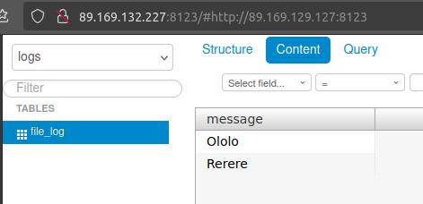
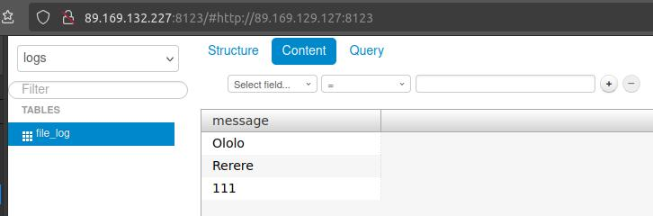

# Домашнее задание к занятию 3 «Использование Ansible»


## Yandex Cloud


> 1. Подготовьте в Yandex Cloud три хоста: для `clickhouse`, для `vector` и для `lighthouse`.


Хосты будем создавать с помощью Terraform.
Конфигурации находятся в каталоге terraform.


### Подготовка


Заполняем параметры облака:
* Создаём файл `personal.auto.tfvars` как копию `personal.auto.tfvars_example`.
* Заполняем поля `cloud_id` и `folder_id` значениями из UI Yandex Cloud.
* Получаем и прописываем IAM-токен в поле `token`.


#### IAM токен


Документация:
* [Начало работы с интерфейсом командной строки](https://yandex.cloud/ru/docs/cli/quickstart#install)
* [Получение IAM-токена для сервисного аккаунта](https://yandex.cloud/ru/docs/iam/operations/iam-token/create-for-sa)

Создать или активировать профиль:
* Список профилей: `yc config profile list`
* Создание профиля: `yc init`
    * OAuth-токен получаем по ссылке со страницы докментации [Начало работы с интерфейсом командной строки](https://yandex.cloud/ru/docs/cli/quickstart#install).
* Активация профиля: `yc config profile activate <profile-name>`

Создать сервисный аккаунт и авторизационный ключ для него:
* Создать сервисный аккаунт с ролью `admin` в Yandex Cloud (через UI)
* Создать авторизационный ключ сервисного аккаунта: `yc iam key create --service-account-name <service-account-name> --output key.json`
* Указать ключ для профиля: `yc config set service-account-key key.json`
* Удалить сгенерированный файл ключа

Получить IAM-токен:
* `yc iam create-token`


### Конфигурация Terraform


Выбираем и прописываем образ ОС:
* Получение списка публичных образов: `yc compute image list --folder-id standard-images`.
* Объявляем образ:
    ```
    data "yandex_compute_image" "host_image" {
        family = "debian-12"
    }
    ```

SSH-ключи:
* Генерим SSH-ключ:
    * В каталоге `ssh`
    * `ssh-keygen -f admin`
* В секции `metadata` прописываем SSH-ключ:
    ```
    metadata = {
        serial-port-enable = 1
        ssh-keys = "admin:${file("../ssh/admin.pub")}"
    }
    ```
    * Не имеет значения, какое имя указано в начале ключа (здесь "admin:").
        Но какое-то имя указано быть должно обязательно, иначе будет не подключиться к машине.
        Имя пользователя по умолчанию в каждом дистрибутиве своё (Debian - debian, Ubuntu - ubuntu).
        Увидеть это имя можно через UI в серийной консоли (поэтому в примере выше и указана опция `serial-port-enable = 1`):
        ```
        ci-info: ++++++++++++++++++++++++++++++++++++Authorized keys from /home/debian/.ssh/authorized_keys for user debian++++++++++++++++++++++++++++++++++++
        ```

NOTE: Здесь приватный и публичный ключи зафиксированы в GIT. Пароль от приватного ключа - "netology".


### Запуск Terraform


```shell
terraform help
terraform init
terraform validate
terraform plan
terraform apply
terraform destroy
```

```
Tuman$ terraform apply
data.yandex_compute_image.default_image: Reading...
data.yandex_compute_image.default_image: Read complete after 0s [id=fd8q49fvba72foa1ol22]

Terraform used the selected providers to generate the following execution plan. Resource actions are indicated with the following symbols:
  + create

Terraform will perform the following actions:

  # yandex_compute_instance.host["clickhouse"] will be created
  ...

  # yandex_compute_instance.host["lighthouse"] will be created
  ...

  # yandex_compute_instance.host["vector"] will be created
  ...

  # yandex_vpc_network.ntlg-a3 will be created
  ...

  # yandex_vpc_subnet.ntlg-a3 will be created
  ...

Plan: 5 to add, 0 to change, 0 to destroy.

Changes to Outputs:
  ...

Do you want to perform these actions?
  Terraform will perform the actions described above.
  Only 'yes' will be accepted to approve.

  Enter a value: yes

yandex_vpc_network.ntlg-a3: Creating...
yandex_vpc_network.ntlg-a3: Creation complete after 2s [id=enp93qc6dbgueh7s4cig]
yandex_vpc_subnet.ntlg-a3: Creating...
yandex_vpc_subnet.ntlg-a3: Creation complete after 0s [id=e9b9750tba2a87mqusqr]
yandex_compute_instance.host["vector"]: Creating...
yandex_compute_instance.host["lighthouse"]: Creating...
yandex_compute_instance.host["clickhouse"]: Creating...
yandex_compute_instance.host["vector"]: Still creating... [10s elapsed]
yandex_compute_instance.host["lighthouse"]: Still creating... [10s elapsed]
yandex_compute_instance.host["clickhouse"]: Still creating... [10s elapsed]
yandex_compute_instance.host["lighthouse"]: Still creating... [20s elapsed]
yandex_compute_instance.host["clickhouse"]: Still creating... [20s elapsed]
yandex_compute_instance.host["vector"]: Still creating... [20s elapsed]
yandex_compute_instance.host["lighthouse"]: Still creating... [30s elapsed]
yandex_compute_instance.host["clickhouse"]: Still creating... [30s elapsed]
yandex_compute_instance.host["vector"]: Still creating... [30s elapsed]
yandex_compute_instance.host["vector"]: Creation complete after 40s [id=fhmfa2u0bvhklgigupa7]
yandex_compute_instance.host["clickhouse"]: Still creating... [40s elapsed]
yandex_compute_instance.host["lighthouse"]: Still creating... [40s elapsed]
yandex_compute_instance.host["lighthouse"]: Creation complete after 45s [id=fhmpgcfduuglc10iu8av]
yandex_compute_instance.host["clickhouse"]: Creation complete after 46s [id=fhmsfm91ieqcf040aj2d]

Apply complete! Resources: 5 added, 0 changed, 0 destroyed.

Outputs:

VMs = [
  {
    "fqdn" = "ntlg-a3-clickhouse.ru-central1.internal"
    "id" = "fhmsfm91ieqcf040aj2d"
    "name" = "clickhouse"
    "network" = [
      {
        "internal_ip" = "192.168.33.13"
        "public_ip" = "51.250.14.51"
      },
    ]
  },
  {
    "fqdn" = "ntlg-a3-lighthouse.ru-central1.internal"
    "id" = "fhmpgcfduuglc10iu8av"
    "name" = "lighthouse"
    "network" = [
      {
        "internal_ip" = "192.168.33.24"
        "public_ip" = "89.169.146.149"
      },
    ]
  },
  {
    "fqdn" = "ntlg-a3-vector.ru-central1.internal"
    "id" = "fhmfa2u0bvhklgigupa7"
    "name" = "vector"
    "network" = [
      {
        "internal_ip" = "192.168.33.36"
        "public_ip" = "89.169.143.157"
      },
    ]
  },
]
```

Все три ВМ создались.
Можем подключиться к любой из них через SSH и выполнить ping другой ВМ.

```
Tuman$ ssh -i ../ssh/admin debian@89.169.143.157
The authenticity of host '89.169.143.157 (89.169.143.157)' can't be established.
ED25519 key fingerprint is SHA256:uLUg3gnDV0DaUmJr3+ULjItxs4Co+aDvMpJjpbGB5Ck.
This key is not known by any other names
Are you sure you want to continue connecting (yes/no/[fingerprint])? yes
Warning: Permanently added '89.169.143.157' (ED25519) to the list of known hosts.
Enter passphrase for key '../ssh/admin':
Linux ntlg-a3-vector 6.1.0-11-amd64 #1 SMP PREEMPT_DYNAMIC Debian 6.1.38-4 (2023-08-08) x86_64

The programs included with the Debian GNU/Linux system are free software;
the exact distribution terms for each program are described in the
individual files in /usr/share/doc/*/copyright.

Debian GNU/Linux comes with ABSOLUTELY NO WARRANTY, to the extent
permitted by applicable law.

debian@ntlg-a3-vector:~$ ping ntlg-a3-clickhouse
PING ntlg-a3-clickhouse.ru-central1.internal (192.168.33.13) 56(84) bytes of data.
64 bytes from ntlg-a3-clickhouse.ru-central1.internal (192.168.33.13): icmp_seq=1 ttl=61 time=0.926 ms
64 bytes from ntlg-a3-clickhouse.ru-central1.internal (192.168.33.13): icmp_seq=2 ttl=61 time=0.366 ms
64 bytes from ntlg-a3-clickhouse.ru-central1.internal (192.168.33.13): icmp_seq=3 ttl=61 time=0.401 ms
^C
--- ntlg-a3-clickhouse.ru-central1.internal ping statistics ---
3 packets transmitted, 3 received, 0% packet loss, time 2003ms
rtt min/avg/max/mdev = 0.366/0.564/0.926/0.256 ms

debian@ntlg-a3-vector:~$ ping ntlg-a3-lighthouse
PING ntlg-a3-lighthouse.ru-central1.internal (192.168.33.24) 56(84) bytes of data.
64 bytes from ntlg-a3-lighthouse.ru-central1.internal (192.168.33.24): icmp_seq=1 ttl=61 time=0.987 ms
64 bytes from ntlg-a3-lighthouse.ru-central1.internal (192.168.33.24): icmp_seq=2 ttl=61 time=0.465 ms
64 bytes from ntlg-a3-lighthouse.ru-central1.internal (192.168.33.24): icmp_seq=3 ttl=61 time=0.412 ms
^C
--- ntlg-a3-lighthouse.ru-central1.internal ping statistics ---
3 packets transmitted, 3 received, 0% packet loss, time 2003ms
rtt min/avg/max/mdev = 0.412/0.621/0.987/0.259 ms
```


## Ansible


> 1. Допишите playbook: нужно сделать ещё один play, который устанавливает и настраивает LightHouse.
> 2. Репозиторий LightHouse находится [по ссылке](https://github.com/VKCOM/lighthouse).
> 2. При создании tasks рекомендую использовать модули: `get_url`, `template`, `yum`, `apt`.
> 3. Tasks должны: скачать статику LightHouse, установить Nginx или любой другой веб-сервер, настроить его конфиг для открытия LightHouse, запустить веб-сервер.
> 4. Подготовьте свой inventory-файл `prod.yml`.


### Подключение к ВМ


Создаём inventory и прописываем туда наши ВМ.

```yml
---
clickhouse:
  hosts:
    clickhouse:
      ansible_host: 51.250.14.51

lighthouse:
  hosts:
    lighthouse:
      ansible_host: 89.169.146.149

vector:
  hosts:
    vector:
      ansible_host: 89.169.143.157
```

Параметры подключения по SSH прописываем в `group_vars/all/ssh.yml`.
Они для всех ВМ одинаковы.

```yml
ansible_user: debian
ansible_private_key_file: ../ssh/admin-nopwd
```

Приватный ключ `ssh/admin` защищён паролем, который Ansible постоянно требует вводить вручную при подключении к каждому хосту.
Сделаем приватный ключ без пароля `admin-nopwd` с помощью скрипта `unprotect-pk.sh` и добавим его в `.gitignore`, чтобы случайно не закоммитить.

```shell
#!/bin/sh

SRC_PK=admin
DST_PK=admin-nopwd

cp ${SRC_PK} ${DST_PK}
chmod 600 ${DST_PK}
ssh-keygen -p -f $DST_PK
```

Запускаем `ansible-playbook`:

```
Tuman$ ansible-playbook site.yml -i inventory

PLAY [Print OS facts] **************************************************************************************************

TASK [Gathering Facts] *************************************************************************************************
ok: [vector]
ok: [clickhouse]
ok: [lighthouse]

TASK [Print OS] ********************************************************************************************************
ok: [clickhouse] => {
    "msg": "Debian 12.6 x86_64"
}
ok: [lighthouse] => {
    "msg": "Debian 12.6 x86_64"
}
ok: [vector] => {
    "msg": "Debian 12.6 x86_64"
}

PLAY RECAP *************************************************************************************************************
clickhouse                 : ok=2    changed=0    unreachable=0    failed=0    skipped=0    rescued=0    ignored=0
lighthouse                 : ok=2    changed=0    unreachable=0    failed=0    skipped=0    rescued=0    ignored=0
vector                     : ok=2    changed=0    unreachable=0    failed=0    skipped=0    rescued=0    ignored=0
```


### Clickhouse


[ClickHouse (Oficial Site)](https://clickhouse.com/)

Создаём play для установки, настройки и запуска Clickhouse:

```yml
- name: Install Clickhouse
  tags:
    - clickhouse
  hosts: clickhouse

  tasks:
    - name: Install common packages
      become: true
      ansible.builtin.apt:
        update_cache: yes
        pkg:
          - gpg
    - name: Add Clickhouse apt-key
      become: true
      ansible.builtin.get_url:
        url: https://packages.clickhouse.com/rpm/lts/repodata/repomd.xml.key
        dest: /etc/apt/trusted.gpg.d/clickhouse.asc
        mode: '0644'
        force: true
    - name: Add Clickhouse apt repository
      become: true
      ansible.builtin.apt_repository:
        update_cache: yes
        repo: deb https://packages.clickhouse.com/deb stable main
        state: present
        filename: clickhouse
    - name: Install Clickhouse
      become: true
      ansible.builtin.apt:
        update_cache: yes
        pkg:
          - clickhouse-server
          - clickhouse-client
        state: present
    - name: Configure Clickhouse
      become: true
      ansible.builtin.template:
        src: files/clickhouse/server.yml
        dest: /etc/clickhouse-server/config.d/server.yml
    - name: Start Clickhouse server
      become: true
      ansible.builtin.service:
        name: clickhouse-server
        state: restarted
    - name: Prepare Clickhouse DB script
      become: true
      ansible.builtin.template:
        src: files/clickhouse/db.sql
        dest: clickhouse-db.sql
    - name: Execute Clickhouse DB script
      ansible.builtin.command: clickhouse-client --queries-file clickhouse-db.sql
      register: create_db
      failed_when: create_db.rc != 0 and create_db.rc != 82
      changed_when: create_db.rc == 0
```

Для доступа из-вне, прописываем конфиг (`files/clickhouse/server.yml`):

```yml
listen_host: 0.0.0.0
```

Создаём БД и таблицу (`files/clickhouse/db.sql`):

```sql
CREATE DATABASE IF NOT EXISTS logs;

CREATE TABLE IF NOT EXISTS logs.file_log(
    message String
)
ENGINE = MergeTree()
ORDER BY tuple()
;
```

Запускаем playbook:

```
Tuman$ ansible-playbook site.yml -i inventory/prod.yml -t clickhouse

PLAY [Print OS facts] **************************************************************************************************

PLAY [Install Clickhouse] **********************************************************************************************

TASK [Gathering Facts] *************************************************************************************************
ok: [clickhouse]

TASK [Install common packages] *****************************************************************************************
ok: [clickhouse]

TASK [Add Clickhouse apt-key] ******************************************************************************************
ok: [clickhouse]

TASK [Add Clickhouse apt repository] ***********************************************************************************
ok: [clickhouse]

TASK [Install Clickhouse] **********************************************************************************************
ok: [clickhouse]

TASK [Configure Clickhouse] ********************************************************************************************
ok: [clickhouse]

TASK [Start Clickhouse server] *****************************************************************************************
changed: [clickhouse]

TASK [Prepare Clickhouse DB script] ************************************************************************************
ok: [clickhouse]

TASK [Execute Clickhouse DB script] ************************************************************************************
changed: [clickhouse]

PLAY RECAP *************************************************************************************************************
clickhouse                 : ok=9    changed=2    unreachable=0    failed=0    skipped=0    rescued=0    ignored=0
```

Проверяем:

```
Tuman$ curl 51.250.14.51:8123
Ok.

Tuman$ ssh -i ../ssh/admin-nopwd debian@51.250.14.51 "clickhouse-client -q 'SELECT * FROM logs.file_log'"
```

NOTE: Данных в таблице пока нет, поэтому результат пустой.
    Если указать некорректное название таблицы, то получим ошибку.
    Т.е. видим, что БД сконфигурирована.


### Vector


[Vector (Oficial Site)](https://vector.dev)

Создаём play для установки, настройки и запуска Vector:

```yml
- name: Install Vector
  tags:
    - vector
  hosts: vector

  tasks:
    - name: Add Vector apt repository
      ansible.builtin.shell: bash -c "$(curl -L https://setup.vector.dev)"
    - name: Install Vector
      become: true
      ansible.builtin.apt:
        update_cache: yes
        pkg:
          - vector
        state: present
    - name: Configure Vector
      become: true
      ansible.builtin.template:
        src: files/vector/vector.yaml
        dest: /etc/vector/vector.yaml
    - name: Create input file
      become: true
      ansible.builtin.file:
        path: /var/vector_input.txt
        state: touch
        owner: vector
        group: vector
        mode: 666
    - name: Create output file
      become: true
      ansible.builtin.file:
        path: /var/vector_output.txt
        state: touch
        owner: vector
        group: vector
        mode: 666
    - name: Start Vector
      become: true
      ansible.builtin.service:
        name: vector
        state: restarted
```

Настраиваем ввод-вывод (`files/vector/vector.yaml`).
Будем читать файл `/var/vector_input.txt` и писать в `stdout`, `/var/vector_output.txt` и в Clickhouse.

```yml
sources:
  filein:
    type: file
    include:
      - /var/vector_input.txt
    read_from: end

sinks:

  stdout:
    inputs:
      - filein
    type: console
    encoding:
      codec: text

  fileout:
    inputs:
      - filein
    type: file
    path: /var/vector_output.txt
    encoding:
      codec: text

  clickhouse:
    inputs:
      - filein
    type: clickhouse
    endpoint: http://ntlg-a3-clickhouse:8123
    database: logs
    table: file_log
    skip_unknown_fields: true
```

Запускаем playbook:

```
$ ansible-playbook site.yml -i inventory/prod.yml -t vector

PLAY [Print OS facts] **************************************************************************************************

PLAY [Install Clickhouse] **********************************************************************************************

PLAY [Install Vector] **************************************************************************************************

TASK [Gathering Facts] *************************************************************************************************
ok: [vector]

TASK [Add Vector apt repository] ***************************************************************************************
changed: [vector]

TASK [Install Vector] **************************************************************************************************
ok: [vector]

TASK [Configure Vector] ************************************************************************************************
ok: [vector]

TASK [Create input file] ***********************************************************************************************
changed: [vector]

TASK [Create output file] **********************************************************************************************
changed: [vector]

TASK [Start Vector] ****************************************************************************************************
changed: [vector]

PLAY RECAP *************************************************************************************************************
vector                     : ok=7    changed=4    unreachable=0    failed=0    skipped=0    rescued=0    ignored=0
```

Проверяем:

```
Tuman$ ssh -i ../ssh/admin-nopwd debian@89.169.143.157

debian@ntlg-a3-vector:~$ sudo service vector status
● vector.service - Vector
     Loaded: loaded (/lib/systemd/system/vector.service; disabled; preset: enabled)
     Active: active (running) since Sat 2024-08-17 17:20:00 UTC; 9min ago
       Docs: https://vector.dev
    Process: 12749 ExecStartPre=/usr/bin/vector validate (code=exited, status=0/SUCCESS)
   Main PID: 12753 (vector)
      Tasks: 5 (limit: 2303)
     Memory: 41.4M
        CPU: 440ms
     CGroup: /system.slice/vector.service
             └─12753 /usr/bin/vector

Aug 17 17:21:12 ntlg-a3-vector vector[12753]: 2024-08-17T17:21:12.310075Z ERROR source{component_kind="source" component_id=filein component_type=file}:file_server: vector::inter>
Aug 17 17:21:14 ntlg-a3-vector vector[12753]: 2024-08-17T17:21:14.359455Z ERROR source{component_kind="source" component_id=filein component_type=file}:file_server: vector::inter>
Aug 17 17:21:22 ntlg-a3-vector vector[12753]: 2024-08-17T17:21:22.556479Z ERROR source{component_kind="source" component_id=filein component_type=file}:file_server: vector::inter>
Aug 17 17:21:22 ntlg-a3-vector vector[12753]: 2024-08-17T17:21:22.556505Z ERROR source{component_kind="source" component_id=filein component_type=file}:file_server: vector::inter>
Aug 17 17:21:24 ntlg-a3-vector vector[12753]: 2024-08-17T17:21:24.605069Z ERROR source{component_kind="source" component_id=filein component_type=file}:file_server: vector::inter>
Aug 17 17:21:32 ntlg-a3-vector vector[12753]: 2024-08-17T17:21:32.802074Z ERROR source{component_kind="source" component_id=filein component_type=file}:file_server: vector::inter>
Aug 17 17:21:32 ntlg-a3-vector vector[12753]: 2024-08-17T17:21:32.802104Z ERROR source{component_kind="source" component_id=filein component_type=file}:file_server: vector::inter>
Aug 17 17:21:34 ntlg-a3-vector vector[12753]: 2024-08-17T17:21:34.851421Z  WARN source{component_kind="source" component_id=filein component_type=file}:file_server: vector::inter>
Aug 17 17:23:29 ntlg-a3-vector vector[12753]: 2024-08-17T17:23:29.607082Z  INFO source{component_kind="source" component_id=filein component_type=file}:file_server: vector::inter>
Aug 17 17:23:29 ntlg-a3-vector vector[12753]: 333

debian@ntlg-a3-vector:~$ cat /var/vector_output.txt
333

debian@ntlg-a3-vector:~$ echo 'Hello, Vector!' >> /var/vector_input.txt
debian@ntlg-a3-vector:~$ cat /var/vector_output.txt
333
Hello, Vector!
```

И проверям Clickhouse:

```
Tuman$ ssh -i ../ssh/admin-nopwd debian@51.250.14.51 "clickhouse-client -q 'SELECT * FROM logs.file_log'"
333
Hello, Vector!
```

Всё работает!


### LightHouse


[LightHouse (Oficial Site)](https://github.com/VKCOM/lighthouse)


Создаём play для установки, настройки и запуска LightHouse:

```yml
- name: Install LightHouse
  tags:
    - lighthouse
  hosts: lighthouse

  tasks:
    - name: Install Nginx
      become: true
      ansible.builtin.apt:
        update_cache: yes
        pkg:
          - nginx
        state: present
    - name: Download LightHouse
      ansible.builtin.get_url:
        url: https://github.com/VKCOM/lighthouse/archive/refs/heads/master.zip
        dest: ./lighthouse.zip
    - name: Unarchive LightHouse
      become: true
      ansible.builtin.unarchive:
        src: ./lighthouse.zip
        remote_src: true
        dest: "/opt"
    - name: Create LightHouse symlink
      become: true
      ansible.builtin.file:
        src: /opt/lighthouse-master
        dest: /opt/lighthouse
        state: link
    - name: Setup LightHouse in Nginx
      become: true
      ansible.builtin.template:
        src: files/lighthouse/lighthouse.conf
        dest: /etc/nginx/conf.d/lighthouse.conf
      notify: Restart Nginx

  handlers:
    - name: Restart Nginx
      become: true
      ansible.builtin.service:
        name: nginx
        state: restarted
```

Настройки для LightHouse в Nginx оформляем, как шаблон (`files/lighthouse/lighthouse.conf`):

```
server {
	listen 8123;
	listen [::]:8123;

	server_name lighthouse.ntlg.tumanser.ru;

	root /opt/lighthouse;
	index index.html;

	location / {
		try_files $uri $uri/ =404;
	}
}
```

NOTE: Доменное имя `lighthouse.ntlg.tumanser.ru` здесь просто "для красоты".
    IP-адрес ВМ к нему не привязан.
    Но и это ДЗ не про эту тему.

Запускаем playbook:

```
Tuman$ ansible-playbook site.yml -i inventory/prod.yml -t lighthouse

PLAY [Print OS facts] **************************************************************************************************

PLAY [Install Clickhouse] **********************************************************************************************

PLAY [Install Vector] **************************************************************************************************

PLAY [Install LightHouse] **********************************************************************************************

TASK [Gathering Facts] *************************************************************************************************
ok: [lighthouse]

TASK [Install Nginx] ***************************************************************************************************
ok: [lighthouse]

TASK [Download LightHouse] *********************************************************************************************
ok: [lighthouse]

TASK [Unarchive LightHouse] ********************************************************************************************
ok: [lighthouse]

TASK [Create LightHouse symlink] ***************************************************************************************
ok: [lighthouse]

TASK [Setup LightHouse in Nginx] ***************************************************************************************
ok: [lighthouse]

PLAY RECAP *************************************************************************************************************
lighthouse                 : ok=6    changed=0    unreachable=0    failed=0    skipped=0    rescued=0    ignored=0
```

Проверяем:

```
Tuman$ yc compute instance list
+----------------------+------------+---------------+---------+----------------+---------------+
|          ID          |    NAME    |    ZONE ID    | STATUS  |  EXTERNAL IP   |  INTERNAL IP  |
+----------------------+------------+---------------+---------+----------------+---------------+
| fhmea28gupfr41ternce | clickhouse | ru-central1-a | RUNNING | 89.169.129.127 | 192.168.33.14 |
| fhmkgb42qhpc5fk6167u | lighthouse | ru-central1-a | RUNNING | 89.169.132.227 | 192.168.33.32 |
| fhmpd3j55qmsjsicple9 | vector     | ru-central1-a | RUNNING | 89.169.135.213 | 192.168.33.13 |
+----------------------+------------+---------------+---------+----------------+---------------+
```

```
Tuman$ ssh -i ssh/admin-nopwd debian@89.169.135.213

debian@ntlg-a3-vector:~$ cat /var/vector_output.txt
debian@ntlg-a3-vector:~$ echo 'Ololo' >> /var/vector_input.txt
debian@ntlg-a3-vector:~$ cat /var/vector_output.txt
Ololo
debian@ntlg-a3-vector:~$ echo 'Rerere' >> /var/vector_input.txt
debian@ntlg-a3-vector:~$ cat /var/vector_output.txt
Ololo
Rerere
```




### Проверка playbook


> 5. Запустите `ansible-lint site.yml` и исправьте ошибки, если они есть.


Устанавливаем `ansible-dev-tools`, который в своём составе содержит `ansible-lit` и другие инструменты, которые могут понадобиться в следующих заданиях.

```shell
pip3 install ansible-dev-tools
ansible-lint --version
```

Запускаем `ansible-lint`:

```
$ ansible-lint site.yml
WARNING  Listing 23 violation(s) that are fatal
fqcn[action-core]: Use FQCN for builtin module actions (debug).
site.yml:8 Use `ansible.builtin.debug` or `ansible.legacy.debug` instead.

yaml[trailing-spaces]: Trailing spaces
site.yml:16

yaml[truthy]: Truthy value should be one of [false, true]
site.yml:21

yaml[trailing-spaces]: Trailing spaces
site.yml:33

yaml[truthy]: Truthy value should be one of [false, true]
site.yml:34

yaml[trailing-spaces]: Trailing spaces
site.yml:36

yaml[trailing-spaces]: Trailing spaces
site.yml:37

yaml[trailing-spaces]: Trailing spaces
site.yml:40

yaml[truthy]: Truthy value should be one of [false, true]
site.yml:41

risky-file-permissions: File permissions unset or incorrect.
site.yml:46 Task/Handler: Configure Clickhouse

risky-file-permissions: File permissions unset or incorrect.
site.yml:56 Task/Handler: Prepare Clickhouse DB script

yaml[trailing-spaces]: Trailing spaces
site.yml:71

no-changed-when: Commands should not change things if nothing needs doing.
site.yml:73 Task/Handler: Add Vector apt repository

yaml[trailing-spaces]: Trailing spaces
site.yml:77

yaml[truthy]: Truthy value should be one of [false, true]
site.yml:78

risky-file-permissions: File permissions unset or incorrect.
site.yml:82 Task/Handler: Configure Vector

yaml[octal-values]: Forbidden implicit octal value "0666"
site.yml:94

yaml[octal-values]: Forbidden implicit octal value "0666"
site.yml:102

yaml[trailing-spaces]: Trailing spaces
site.yml:113

yaml[trailing-spaces]: Trailing spaces
site.yml:117

yaml[truthy]: Truthy value should be one of [false, true]
site.yml:118

risky-file-permissions: File permissions unset or incorrect.
site.yml:122 Task/Handler: Download LightHouse

risky-file-permissions: File permissions unset or incorrect.
site.yml:138 Task/Handler: Setup LightHouse in Nginx

Read documentation for instructions on how to ignore specific rule violations.

                       Rule Violation Summary
 count tag                    profile    rule associated tags
     2 yaml[octal-values]     basic      formatting, yaml
     9 yaml[trailing-spaces]  basic      formatting, yaml
     5 yaml[truthy]           basic      formatting, yaml
     5 risky-file-permissions safety     unpredictability
     1 no-changed-when        shared     command-shell, idempotency
     1 fqcn[action-core]      production formatting

Failed: 23 failure(s), 0 warning(s) on 1 files. Last profile that met the validation criteria was 'min'.
```

Исправляем:

```diff
diff --git a/03-ansible/03/playbook/site.yml b/03-ansible/03/playbook/site.yml
index 83e748c..54da327 100755
--- a/03-ansible/03/playbook/site.yml
+++ b/03-ansible/03/playbook/site.yml
@@ -6,19 +6,19 @@
   hosts: all
   tasks:
     - name: Print OS
-      debug:
+      ansible.builtin.debug:
         msg: "{{ ansible_distribution }} {{ ansible_distribution_version }} {{ ansible_architecture }}"

 - name: Install Clickhouse
   tags:
     - clickhouse
   hosts: clickhouse
-
+
   tasks:
     - name: Install common packages
       become: true
       ansible.builtin.apt:
-        update_cache: yes
+        update_cache: true
         pkg:
           - gpg
     - name: Add Clickhouse apt-key
@@ -30,15 +30,15 @@
         force: true
     - name: Add Clickhouse apt repository
       become: true
-      ansible.builtin.apt_repository:
-        update_cache: yes
+      ansible.builtin.apt_repository:
+        update_cache: true
         repo: deb https://packages.clickhouse.com/deb stable main
-        state: present
-        filename: clickhouse
+        state: present
+        filename: clickhouse
     - name: Install Clickhouse
       become: true
-      ansible.builtin.apt:
-        update_cache: yes
+      ansible.builtin.apt:
+        update_cache: true
         pkg:
           - clickhouse-server
           - clickhouse-client
@@ -48,6 +48,7 @@
       ansible.builtin.template:
         src: files/clickhouse/server.yml
         dest: /etc/clickhouse-server/config.d/server.yml
+        mode: '0664'
     - name: Start Clickhouse server
       become: true
       ansible.builtin.service:
@@ -58,6 +59,7 @@
       ansible.builtin.template:
         src: files/clickhouse/db.sql
         dest: clickhouse-db.sql
+        mode: '0664'
     - name: Execute Clickhouse DB script
       ansible.builtin.command: clickhouse-client --queries-file clickhouse-db.sql
       register: create_db
@@ -68,14 +70,17 @@
   tags:
     - vector
   hosts: vector
-
+
   tasks:
     - name: Add Vector apt repository
       ansible.builtin.shell: bash -c "$(curl -L https://setup.vector.dev)"
+      register: result
+      changed_when: result.rc == 0
+      failed_when: result.rc != 0
     - name: Install Vector
       become: true
-      ansible.builtin.apt:
-        update_cache: yes
+      ansible.builtin.apt:
+        update_cache: true
         pkg:
           - vector
         state: present
@@ -84,6 +89,7 @@
       ansible.builtin.template:
         src: files/vector/vector.yaml
         dest: /etc/vector/vector.yaml
+        mode: '0664'
     - name: Create input file
       become: true
       ansible.builtin.file:
@@ -91,7 +97,7 @@
         state: touch
         owner: vector
         group: vector
-        mode: 0666
+        mode: '0666'
     - name: Create output file
       become: true
       ansible.builtin.file:
@@ -99,7 +105,7 @@
         state: touch
         owner: vector
         group: vector
-        mode: 0666
+        mode: '0665'
     - name: Start Vector
       become: true
       ansible.builtin.service:
@@ -110,12 +116,12 @@
   tags:
     - lighthouse
   hosts: lighthouse
-
+
   tasks:
     - name: Install Nginx
       become: true
-      ansible.builtin.apt:
-        update_cache: yes
+      ansible.builtin.apt:
+        update_cache: true
         pkg:
           - nginx
         state: present
@@ -123,6 +129,7 @@
       ansible.builtin.get_url:
         url: https://github.com/VKCOM/lighthouse/archive/refs/heads/master.zip
         dest: ./lighthouse.zip
+        mode: '0665'
     - name: Unarchive LightHouse
       become: true
       ansible.builtin.unarchive:
@@ -140,6 +147,7 @@
       ansible.builtin.template:
         src: files/lighthouse/lighthouse.conf
         dest: /etc/nginx/conf.d/lighthouse.conf
+        mode: '0664'
       notify: Restart Nginx

   handlers:
```

Проверяем:

```
Tuman$ ansible-lint site.yml

Passed: 0 failure(s), 0 warning(s) on 1 files. Last profile that met the validation criteria was 'production'.
```

```
Tuman$ ansible-playbook site.yml -i inventory/prod.yml

...

PLAY RECAP *************************************************************************************************************
clickhouse                 : ok=11   changed=4    unreachable=0    failed=0    skipped=0    rescued=0    ignored=0
lighthouse                 : ok=9    changed=3    unreachable=0    failed=0    skipped=0    rescued=0    ignored=0
vector                     : ok=9    changed=5    unreachable=0    failed=0    skipped=0    rescued=0    ignored=0
```

Проверяем, что ничего не сломалось:

```
debian@ntlg-a3-vector:~$ cat /var/vector_output.txt
Ololo
Rerere
debian@ntlg-a3-vector:~$ echo '111' >> /var/vector_input.txt
debian@ntlg-a3-vector:~$ cat /var/vector_output.txt
Ololo
Rerere
111
```




> 6. Попробуйте запустить playbook на этом окружении с флагом `--check`.


```
$ ansible-playbook site.yml -i inventory/prod.yml --check

PLAY [Print OS facts] **************************************************************************************************

TASK [Gathering Facts] *************************************************************************************************
ok: [vector]
ok: [lighthouse]
ok: [clickhouse]

TASK [Print OS] ********************************************************************************************************
ok: [clickhouse] => {
    "msg": "Debian 12.6 x86_64"
}
ok: [lighthouse] => {
    "msg": "Debian 12.6 x86_64"
}
ok: [vector] => {
    "msg": "Debian 12.6 x86_64"
}

PLAY [Install Clickhouse] **********************************************************************************************

TASK [Gathering Facts] *************************************************************************************************
ok: [clickhouse]

TASK [Install common packages] *****************************************************************************************
ok: [clickhouse]

TASK [Add Clickhouse apt-key] ******************************************************************************************
changed: [clickhouse]

TASK [Add Clickhouse apt repository] ***********************************************************************************
ok: [clickhouse]

TASK [Install Clickhouse] **********************************************************************************************
ok: [clickhouse]

TASK [Configure Clickhouse] ********************************************************************************************
ok: [clickhouse]

TASK [Start Clickhouse server] *****************************************************************************************
changed: [clickhouse]

TASK [Prepare Clickhouse DB script] ************************************************************************************
ok: [clickhouse]

TASK [Execute Clickhouse DB script] ************************************************************************************
skipping: [clickhouse]

PLAY [Install Vector] **************************************************************************************************

TASK [Gathering Facts] *************************************************************************************************
ok: [vector]

TASK [Add Vector apt repository] ***************************************************************************************
skipping: [vector]

TASK [Install Vector] **************************************************************************************************
ok: [vector]

TASK [Configure Vector] ************************************************************************************************
ok: [vector]

TASK [Create input file] ***********************************************************************************************
changed: [vector]

TASK [Create output file] **********************************************************************************************
changed: [vector]

TASK [Start Vector] ****************************************************************************************************
changed: [vector]

PLAY [Install LightHouse] **********************************************************************************************

TASK [Gathering Facts] *************************************************************************************************
ok: [lighthouse]

TASK [Install Nginx] ***************************************************************************************************
ok: [lighthouse]

TASK [Download LightHouse] *********************************************************************************************
ok: [lighthouse]

TASK [Unarchive LightHouse] ********************************************************************************************
ok: [lighthouse]

TASK [Create LightHouse symlink] ***************************************************************************************
ok: [lighthouse]

TASK [Setup LightHouse in Nginx] ***************************************************************************************
ok: [lighthouse]

PLAY RECAP *************************************************************************************************************
clickhouse                 : ok=10   changed=2    unreachable=0    failed=0    skipped=1    rescued=0    ignored=0
lighthouse                 : ok=8    changed=0    unreachable=0    failed=0    skipped=0    rescued=0    ignored=0
vector                     : ok=8    changed=3    unreachable=0    failed=0    skipped=1    rescued=0    ignored=0
```


> 7. Запустите playbook на `prod.yml` окружении с флагом `--diff`. Убедитесь, что изменения на системе произведены.
> 8. Повторно запустите playbook с флагом `--diff` и убедитесь, что playbook идемпотентен.

```
$ ansible-playbook site.yml -i inventory/prod.yml --diff

PLAY [Print OS facts] **************************************************************************************************

TASK [Gathering Facts] *************************************************************************************************
ok: [vector]
ok: [clickhouse]
ok: [lighthouse]

TASK [Print OS] ********************************************************************************************************
ok: [clickhouse] => {
    "msg": "Debian 12.6 x86_64"
}
ok: [lighthouse] => {
    "msg": "Debian 12.6 x86_64"
}
ok: [vector] => {
    "msg": "Debian 12.6 x86_64"
}

PLAY [Install Clickhouse] **********************************************************************************************

TASK [Gathering Facts] *************************************************************************************************
ok: [clickhouse]

TASK [Install common packages] *****************************************************************************************
ok: [clickhouse]

TASK [Add Clickhouse apt-key] ******************************************************************************************
ok: [clickhouse]

TASK [Add Clickhouse apt repository] ***********************************************************************************
ok: [clickhouse]

TASK [Install Clickhouse] **********************************************************************************************
ok: [clickhouse]

TASK [Configure Clickhouse] ********************************************************************************************
ok: [clickhouse]

TASK [Start Clickhouse server] *****************************************************************************************
changed: [clickhouse]

TASK [Prepare Clickhouse DB script] ************************************************************************************
ok: [clickhouse]

TASK [Execute Clickhouse DB script] ************************************************************************************
changed: [clickhouse]

PLAY [Install Vector] **************************************************************************************************

TASK [Gathering Facts] *************************************************************************************************
ok: [vector]

TASK [Add Vector apt repository] ***************************************************************************************
changed: [vector]

TASK [Install Vector] **************************************************************************************************
ok: [vector]

TASK [Configure Vector] ************************************************************************************************
ok: [vector]

TASK [Create input file] ***********************************************************************************************
--- before
+++ after
@@ -1,6 +1,6 @@
 {
-    "atime": 1723966578.0674372,
-    "mtime": 1723966574.163343,
+    "atime": 1723966627.9891443,
+    "mtime": 1723966627.9891443,
     "path": "/var/vector_input.txt",
-    "state": "file"
+    "state": "touch"
 }

changed: [vector]

TASK [Create output file] **********************************************************************************************
--- before
+++ after
@@ -1,6 +1,6 @@
 {
-    "atime": 1723966574.6753554,
-    "mtime": 1723966574.6753554,
+    "atime": 1723966628.5072615,
+    "mtime": 1723966628.5072615,
     "path": "/var/vector_output.txt",
-    "state": "file"
+    "state": "touch"
 }

changed: [vector]

TASK [Start Vector] ****************************************************************************************************
changed: [vector]

PLAY [Install LightHouse] **********************************************************************************************

TASK [Gathering Facts] *************************************************************************************************
ok: [lighthouse]

TASK [Install Nginx] ***************************************************************************************************
ok: [lighthouse]

TASK [Download LightHouse] *********************************************************************************************
ok: [lighthouse]

TASK [Unarchive LightHouse] ********************************************************************************************
ok: [lighthouse]

TASK [Create LightHouse symlink] ***************************************************************************************
ok: [lighthouse]

TASK [Setup LightHouse in Nginx] ***************************************************************************************
ok: [lighthouse]

PLAY RECAP *************************************************************************************************************
clickhouse                 : ok=11   changed=2    unreachable=0    failed=0    skipped=0    rescued=0    ignored=0
lighthouse                 : ok=8    changed=0    unreachable=0    failed=0    skipped=0    rescued=0    ignored=0
vector                     : ok=9    changed=4    unreachable=0    failed=0    skipped=0    rescued=0    ignored=0
```

NOTE: Как видим, есть некоторая "неидемпотентность", заключающаяся, в основном, в задачах по перезапуску сервисов и пересозданию входного и выходного файлов для Vector.


### Описание playbook


> 9. Подготовьте README.md-файл по своему playbook. В нём должно быть описано: что делает playbook, какие у него есть параметры и теги.

См. [readme.md](playbook/readme.md)
