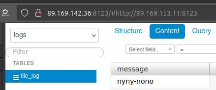

# Домашнее задание к занятию 4 «Работа с roles»


> Ваша цель — разбить ваш playbook на отдельные roles.
> Задача — сделать roles для ClickHouse, Vector и LightHouse и написать playbook для использования этих ролей.
> Ожидаемый результат — существуют три ваших репозитория: два с roles и один с playbook.


## Ссылки

* [ClickHouse](https://clickhouse.com)
* [LightHouse](https://github.com/VKCOM/lighthouse)
* [Vector](https://vector.dev)
    * [Vector + ClickHouse](https://vector.dev/docs/reference/configuration/sinks/clickhouse/)


## Подготовка к выполнению


В этом задании необходимо модифицировать сделанный и отлаженный ранее playbook.
Поэтому за основу возьмём (скопируем) terraform и playbook из предыдущего задания.


## ClickHouse role


> 1. Создайте в старой версии playbook файл `requirements.yml` и заполните его содержимым.
> 2. При помощи `ansible-galaxy` скачайте себе эту роль.

Устанавливаем роли из `requirements.yml`:

```shell
ansible-galaxy install -r requirements.yml -p roles
```

NOTE: Без флага `-p roles` роль будет установлена в домашний каталог пользователя `${HOME}/.ansible/roles`.

NOTE: Если произошла ошибка "Permission denied (publickey)" при выкачивании репозитория роли с github.com по протоколу ssh (`git@github.com:...`),
    то нужно сгенерировать ssh-ключ (`ssh-keygen -f key-file-name`) и прописать его в `${HOME}/.ssh/config`:

```
Host github.com
    IdentityFile ~/.ssh/key-file-name
```

Подключаем роль:

```yml
- name: Install Clickhouse
  tags:
    - clickhouse
  hosts: clickhouse

  pre_tasks:
    - name: Install common packages
      become: true
      ansible.builtin.apt:
        update_cache: true
        pkg:
          - gpg

  roles:
    - role: clickhouse
      vars:
        clickhouse_listen_host:
          - "::"
        # Uncomment to LightHouse could connect to ClickHouse
        # clickhouse_networks_default:
        #   - "::/0"
        clickhouse_users_custom:
          - name: vector
            password: veve
            networks:
              - "::/0"
            profile: default
            quota: default
            dbs:
              - logs
            comment: User for Vector
        clickhouse_dbs_custom:
          - name: logs

  post_tasks:
    - name: Prepare Clickhouse DB script
      become: true
      ansible.builtin.template:
        src: files/clickhouse/db.sql
        dest: clickhouse-db.sql
        mode: '0664'
    - name: Execute Clickhouse DB script
      ansible.builtin.command: clickhouse-client --queries-file clickhouse-db.sql
      register: create_db
      failed_when: create_db.rc != 0 and create_db.rc != 82
      changed_when: create_db.rc == 0
```

Тестируем:

```shell
CLICKHOUSE_IP=51.250.72.19
ssh -i ../ssh/admin-nopwd debian@$CLICKHOUSE_IP "clickhouse-client -q 'SELECT * FROM logs.file_log'"
curl $CLICKHOUSE_IP:8123
echo 'SELECT 1' | curl --user vector $CLICKHOUSE_IP:8123/?query= --data-binary @-
echo 'SELECT * FROM logs.file_log' | curl --user vector $CLICKHOUSE_IP:8123/?query= --data-binary @-
```

```
Tuman$ CLICKHOUSE_IP=51.250.72.19

Tuman$ ssh -i ../ssh/admin-nopwd debian@$CLICKHOUSE_IP "clickhouse-client -q 'SELECT * FROM logs.file_log'"
111

Tuman$ curl $CLICKHOUSE_IP:8123
Ok.

Tuman$ echo 'SELECT 1' | curl --user vector $CLICKHOUSE_IP:8123/?query= --data-binary @-
Enter host password for user 'vector':
1

Tuman$ echo 'SELECT * FROM logs.file_log' | curl --user vector $CLICKHOUSE_IP:8123/?query= --data-binary @-
Enter host password for user 'vector':
111
```


## Vector role


> 3. Создайте новый каталог с ролью при помощи `ansible-galaxy role init vector-role`.
> 4. На основе tasks из старого playbook заполните новую role. Разнесите переменные между `vars` и `default`.
> 5. Перенести нужные шаблоны конфигов в `templates`.

Создаём заготовку роли:

```shell
ansible-galaxy role init vector-role
```

Удаляем всё ненужное, переносим tasks, templates.

Подключаем роль вместо tasks:

```yml
- name: Install Vector
  tags:
    - vector
  hosts: vector

  roles:
    - role: vector-role
```

Проверяем:

```
Tuman$ ssh -i ../ssh/admin-nopwd debian@89.169.146.244
...

debian@ntlg-a4-vector:~$ cat /var/vector_output.txt
debian@ntlg-a4-vector:~$ echo oioioi >> /var/vector_input.txt
debian@ntlg-a4-vector:~$ cat /var/vector_output.txt
oioioi
```

```
Tuman$ echo 'SELECT * FROM logs.file_log' | curl --user vector $CLICKHOUSE_IP:8123/?query= --data-binary @-
Enter host password for user 'vector':
oioioi
```


## LightHouse role


> 7. Повторите шаги 3–6 для LightHouse. Помните, что одна роль должна настраивать один продукт.


Всё тоже самое:

```yml
- name: Install LightHouse
  tags:
    - lighthouse
  hosts: lighthouse

  roles:
    - role: lighthouse
```

Проверяем:

```
Tuman$ ssh -i ../ssh/admin-nopwd debian@89.169.131.97
...
debian@ntlg-a4-vector:~$ cat /var/vector_output.txt
debian@ntlg-a4-vector:~$ echo nyny-nono >> /var/vector_input.txt
debian@ntlg-a4-vector:~$ cat /var/vector_output.txt
nyny-nono
```




## Roles to GitHub


> 8. Выложите все roles в репозитории. Проставьте теги, используя семантическую нумерацию. Добавьте roles в `requirements.yml` в playbook.
> 9. Переработайте playbook на использование roles. Не забудьте про зависимости LightHouse и возможности совмещения `roles` с `tasks`.

* Создаём ропизитории в GitHub, пушим туда роли, пушим теги
* Обновляем `requirements.yml`
* Удляем роли из `roles/`
* Убираем из исключений `.gitignore`
* Делаем backup в каталоге `git`
* Добавляем ссылки на GIT-репозитории ролей:
    * https://github.com/tundravarg/netology-ansible-vector.git
    * https://github.com/tundravarg/netology-ansible-lighthouse.git

`requirements.yml`:

```yml
---
- name: clickhouse
  src: git@github.com:AlexeySetevoi/ansible-clickhouse.git
  scm: git
  version: "1.13"
- name: vector
  src: https://github.com/tundravarg/netology-ansible-vector.git
  scm: git
  version: "0.0.1"
- name: lighthouse
  src: https://github.com/tundravarg/netology-ansible-lighthouse.git
  scm: git
  version: "0.0.1"
```

Тестируем:

```
rm -r roles
ansible-galaxy install -r requirements.yml -p roles
ansible-playbook site.yml -i inventory/prod.yml
```

```
Tuman$ ssh -i ../ssh/admin-nopwd debian@89.169.153.207
...
debian@ntlg-a4-vector:~$ cat /var/vector_output.txt
debian@ntlg-a4-vector:~$ echo 'Hello, GIT Roles' >> /var/vector_input.txt
debian@ntlg-a4-vector:~$ cat /var/vector_output.txt
Hello, GIT Roles
```

```
Tuman$ echo 'SELECT * FROM logs.file_log' | curl --user vector $CLICKHOUSE_IP:8123/?query= --data-binary @-
Enter host password for user 'vector':
Hello, GIT Roles
```
