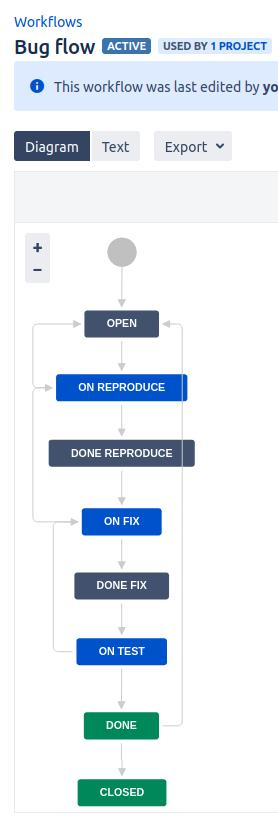
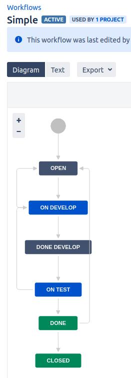
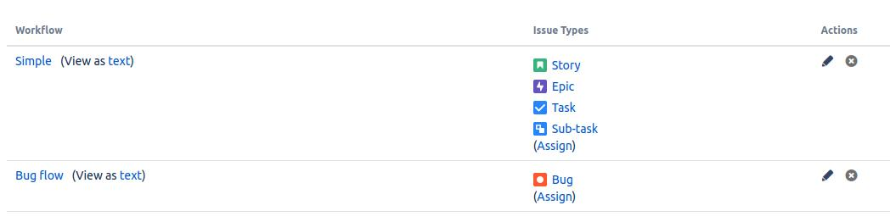
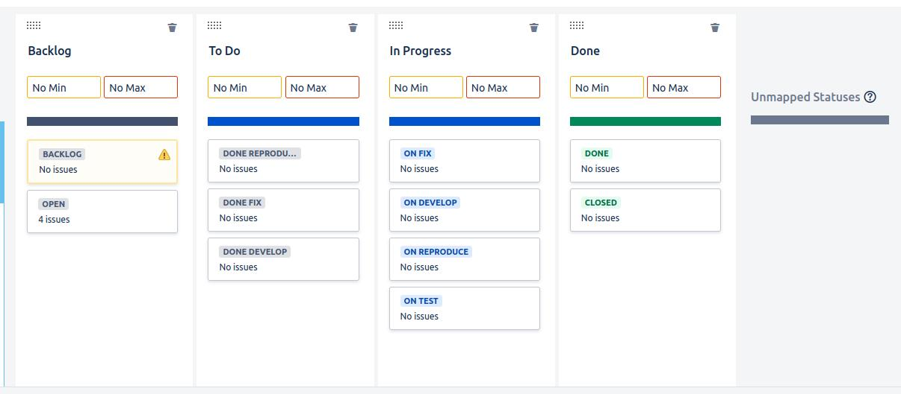
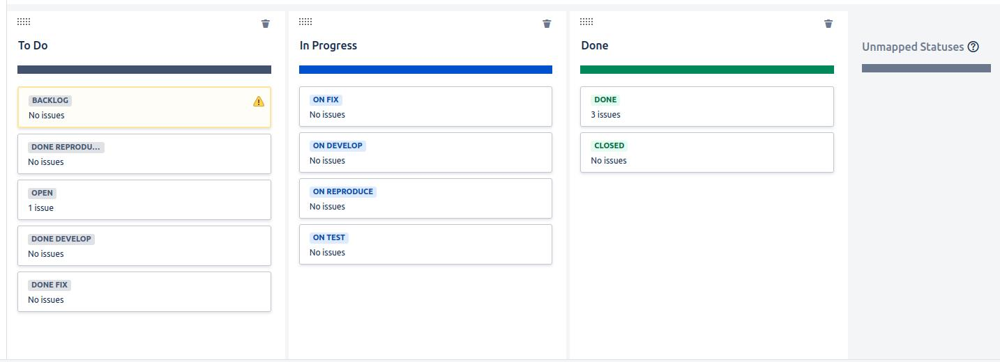

# Домашнее задание к занятию 7 «Жизненный цикл ПО»

## Установка Jira

Jira запущена посредством docker-compose, приведённым в каталоге `jira`.

Из особенностей:
* Через 90 дней триал протухнет, а он привязан к личному e-mail.
* Для того, чтобы данные в Jira не потерялись от запуска к запуску, был примонтирован volume.
    Но при старте контейнера он получил владельца, группу и права, отличные от моего пользовательского аккаунта.
    Т.о. пото придётся удалять его через `sudo`. А если бы админских прав не было...

## Создать доски Kanban и Scrum

## Workflow

[Bug flow.xml](files/Bug%20flow.xml)

[Simple.xml](files/Simple.xml)

