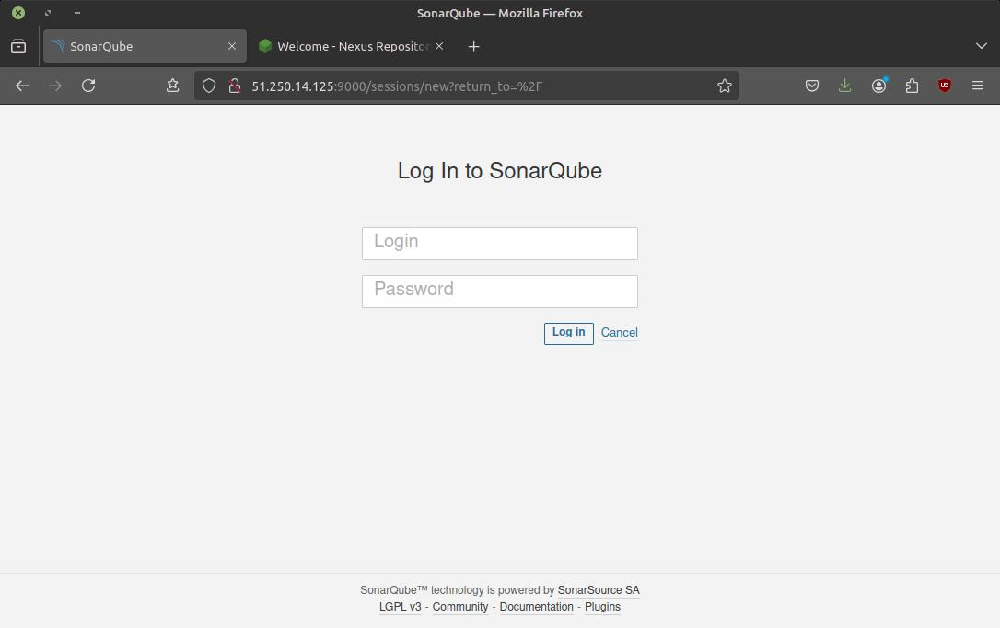
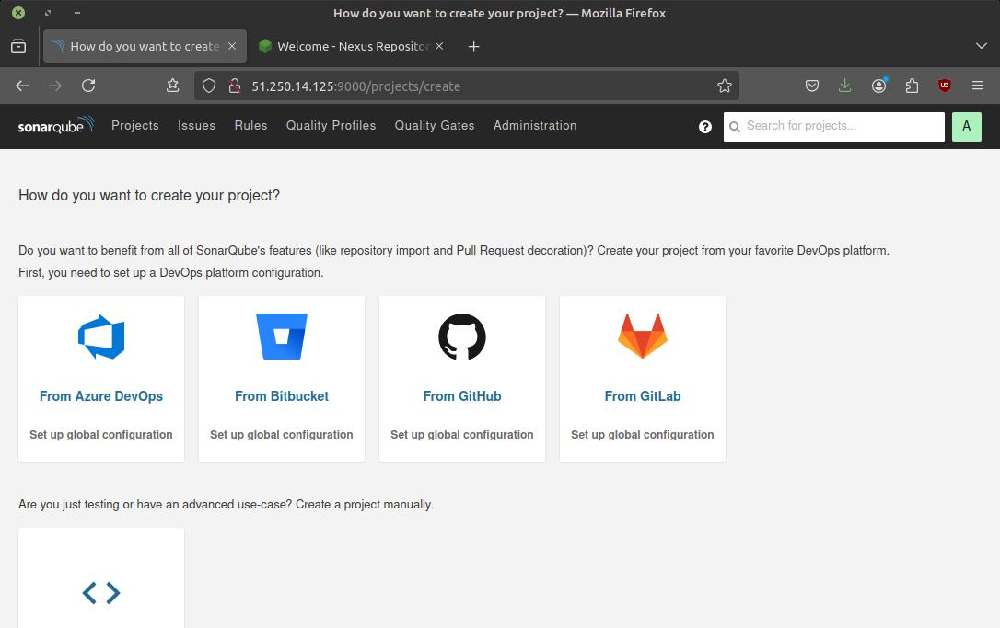
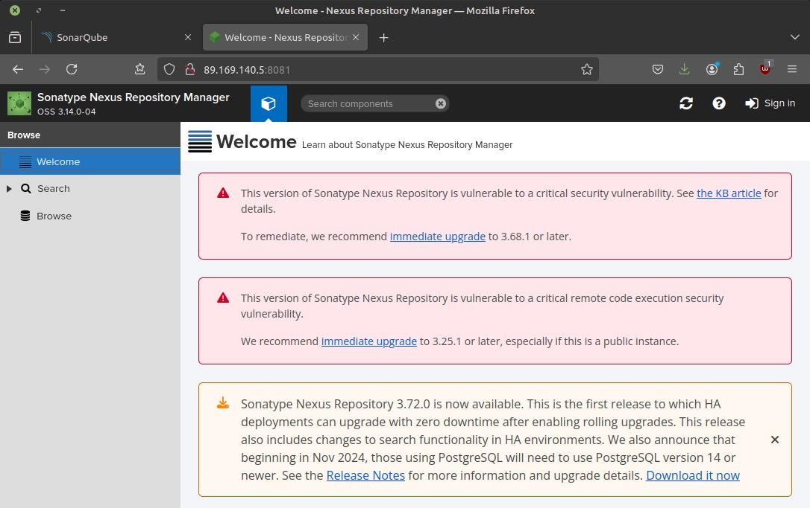
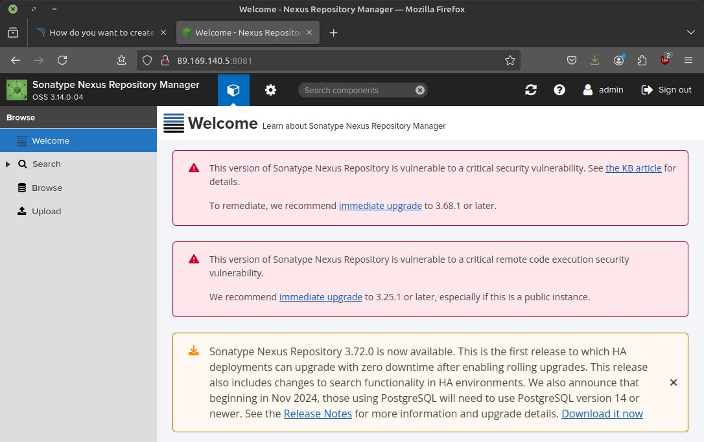

# Домашнее задание к занятию 9 «Процессы CI/CD»


## Подготовка к выполнению


> 1. Создайте два VM в Yandex Cloud с параметрами: 2CPU 4RAM Centos7 (остальное по минимальным требованиям).


Создаём через Terraform:

* Конфигурация в каталоге `terraform`.
    * Создаём и заполняем `personal.auto.tfvars` на основе заготовки `personal.auto.tfvars_example`.
* SSH-ключи к ВМ в каталоге `ssh`.
    * Для создания приватного ключа без пароля используем скрипт `unprotect-pk.sh` (пароль `netology`).


> 2. Пропишите в [inventory](./infrastructure/inventory/cicd/hosts.yml) [playbook](./infrastructure/site.yml) созданные хосты.
> 3. Добавьте в [files](./infrastructure/files/) файл со своим публичным ключом (id_rsa.pub). Если ключ называется иначе — найдите таску в плейбуке, которая использует id_rsa.pub имя, и исправьте на своё.
> 4. Запустите playbook, ожидайте успешного завершения.


Прописываем IP'шники, пользователя и ssh-ключ:

```diff
diff --git a/04-ci/03/infrastructure/inventory/cicd/hosts.yml b/04-ci/03/infrastructure/inventory/cicd/hosts.yml
@@ -2,9 +2,9 @@
 all:
   hosts:
     sonar-01:
-      ansible_host: <somehost2>
+      ansible_host: 51.250.14.125
     nexus-01:
-      ansible_host: <somehost>
+      ansible_host: 89.169.140.5
   children:
     sonarqube:
       hosts:
@@ -17,4 +17,5 @@ all:
         sonar-01:
   vars:
     ansible_connection_type: paramiko
-    ansible_user: <someuser>
\ No newline at end of file
+    ansible_user: centos
+    ansible_private_key_file: ../ssh/admin-nopwd

diff --git a/04-ci/03/infrastructure/site.yml b/04-ci/03/infrastructure/site.yml
@@ -117,7 +117,7 @@
       authorized_key:
         user: "{{ sonarqube_db_user }}"
         state: present
-        key: "{{ lookup('file', 'id_rsa.pub') }}"
+        key: "{{ lookup('file', '../ssh/admin.pub') }}"
 
     - name: "Allow group to have passwordless sudo"
       lineinfile:
```

Postgres 11 не устанавливается.
В стандартном репозитории его нет, там Postgres 9.
А в репозиториях, устанавливаемых в "Install PostgreSQL repos" - Postgres 12 и выше.

Идём по пути минимального сопротивления и переходим с Postgres 11 на Postgres 12:

```diff
diff --git a/04-ci/03/infrastructure/inventory/cicd/group_vars/postgres.yml b/04-ci/03/infrastructure/inventory/cicd/group_vars/postgres.yml
@@ -1 +1 @@
-postgresql_version: 11
+postgresql_version: 12

diff --git a/04-ci/03/infrastructure/site.yml b/04-ci/03/infrastructure/site.yml
@@ -45,14 +45,6 @@
   hosts: postgres
   become: true
   tasks:
-    - name: Change repo file
-      copy:
-        src: CentOS-Base.repo
-        dest: /etc/yum.repos.d/CentOS-Base.repo
-        mode: 0644
-        owner: root
-        group: root
-
     - name: Install PostgreSQL repos
       yum:
         name: https://download.postgresql.org/pub/repos/yum/reporpms/EL-7-x86_64/pgdg-redhat-repo-latest.noarch.rpm
@@ -65,7 +57,7 @@
         state: present
 
     - name: Init template1 DB
-      command: /usr/pgsql-11/bin/postgresql-11-setup initdb
+      command: /usr/pgsql-{{ postgresql_version }}/bin/postgresql-{{ postgresql_version }}-setup initdb
       failed_when: false
 
     - name: Start pgsql service
@@ -94,7 +86,7 @@
     - name: Copy pg_hba.conf
       copy:
         src: pg_hba.conf
-        dest: /var/lib/pgsql/11/data/pg_hba.conf
+        dest: /var/lib/pgsql/{{ postgresql_version }}/data/pg_hba.conf
         mode: 0600
         owner: postgres
         group: postgres

diff --git a/04-ci/03/infrastructure/files/CentOS-Base.repo b/04-ci/03/infrastructure/files/CentOS-Base.repo
deleted file mode 100644
index 0984327..0000000
--- a/04-ci/03/infrastructure/files/CentOS-Base.repo
+++ /dev/null
```

После этого весь playbook отработал.


> 5. Проверьте готовность SonarQube через [браузер](http://localhost:9000).
> 6. Зайдите под admin\admin, поменяйте пароль на свой.







> 7. Проверьте готовность Nexus через [бразуер](http://localhost:8081).
> 8. Подключитесь под admin\admin123, поменяйте пароль, сохраните анонимный доступ.





