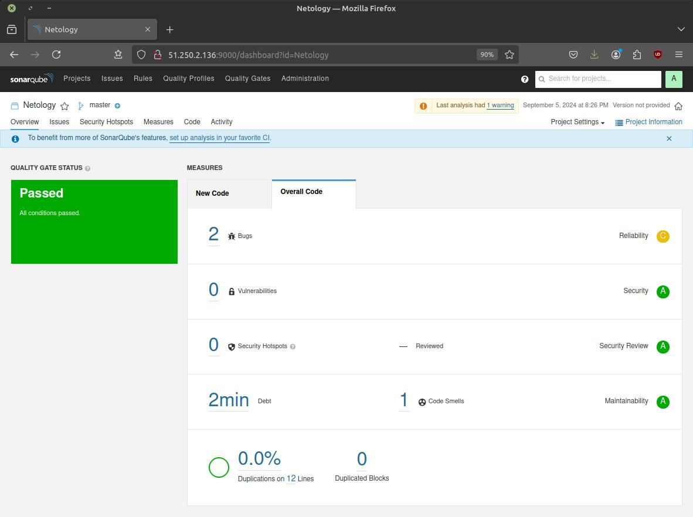
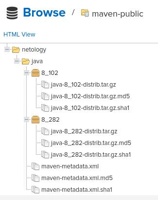

# Домашнее задание к занятию 9 «Процессы CI/CD»


## Подготовка к выполнению


> 1. Создайте два VM в Yandex Cloud с параметрами: 2CPU 4RAM Centos7 (остальное по минимальным требованиям).


Создаём через Terraform:

* Конфигурация в каталоге `terraform`.
    * Создаём и заполняем `personal.auto.tfvars` на основе заготовки `personal.auto.tfvars_example`.
* SSH-ключи к ВМ в каталоге `ssh`.
    * Для создания приватного ключа без пароля используем скрипт `unprotect-pk.sh` (пароль `netology`).


> 2. Пропишите в [inventory](./infrastructure/inventory/cicd/hosts.yml) [playbook](./infrastructure/site.yml) созданные хосты.
> 3. Добавьте в [files](./infrastructure/files/) файл со своим публичным ключом (id_rsa.pub). Если ключ называется иначе — найдите таску в плейбуке, которая использует id_rsa.pub имя, и исправьте на своё.
> 4. Запустите playbook, ожидайте успешного завершения.


Прописываем IP'шники, пользователя и ssh-ключ:

```diff
diff --git a/04-ci/03/infrastructure/inventory/cicd/hosts.yml b/04-ci/03/infrastructure/inventory/cicd/hosts.yml
@@ -2,9 +2,9 @@
 all:
   hosts:
     sonar-01:
-      ansible_host: <somehost2>
+      ansible_host: 51.250.14.125
     nexus-01:
-      ansible_host: <somehost>
+      ansible_host: 89.169.140.5
   children:
     sonarqube:
       hosts:
@@ -17,4 +17,5 @@ all:
         sonar-01:
   vars:
     ansible_connection_type: paramiko
-    ansible_user: <someuser>
\ No newline at end of file
+    ansible_user: centos
+    ansible_private_key_file: ../ssh/admin-nopwd

diff --git a/04-ci/03/infrastructure/site.yml b/04-ci/03/infrastructure/site.yml
@@ -117,7 +117,7 @@
       authorized_key:
         user: "{{ sonarqube_db_user }}"
         state: present
-        key: "{{ lookup('file', 'id_rsa.pub') }}"
+        key: "{{ lookup('file', '../ssh/admin.pub') }}"
 
     - name: "Allow group to have passwordless sudo"
       lineinfile:
```

Postgres 11 не устанавливается.
В стандартном репозитории его нет, там Postgres 9.
А в репозиториях, устанавливаемых в "Install PostgreSQL repos" - Postgres 12 и выше.

Идём по пути минимального сопротивления и переходим с Postgres 11 на Postgres 12:

```diff
diff --git a/04-ci/03/infrastructure/inventory/cicd/group_vars/postgres.yml b/04-ci/03/infrastructure/inventory/cicd/group_vars/postgres.yml
@@ -1 +1 @@
-postgresql_version: 11
+postgresql_version: 12

diff --git a/04-ci/03/infrastructure/site.yml b/04-ci/03/infrastructure/site.yml
@@ -45,14 +45,6 @@
   hosts: postgres
   become: true
   tasks:
-    - name: Change repo file
-      copy:
-        src: CentOS-Base.repo
-        dest: /etc/yum.repos.d/CentOS-Base.repo
-        mode: 0644
-        owner: root
-        group: root
-
     - name: Install PostgreSQL repos
       yum:
         name: https://download.postgresql.org/pub/repos/yum/reporpms/EL-7-x86_64/pgdg-redhat-repo-latest.noarch.rpm
@@ -65,7 +57,7 @@
         state: present
 
     - name: Init template1 DB
-      command: /usr/pgsql-11/bin/postgresql-11-setup initdb
+      command: /usr/pgsql-{{ postgresql_version }}/bin/postgresql-{{ postgresql_version }}-setup initdb
       failed_when: false
 
     - name: Start pgsql service
@@ -94,7 +86,7 @@
     - name: Copy pg_hba.conf
       copy:
         src: pg_hba.conf
-        dest: /var/lib/pgsql/11/data/pg_hba.conf
+        dest: /var/lib/pgsql/{{ postgresql_version }}/data/pg_hba.conf
         mode: 0600
         owner: postgres
         group: postgres

diff --git a/04-ci/03/infrastructure/files/CentOS-Base.repo b/04-ci/03/infrastructure/files/CentOS-Base.repo
deleted file mode 100644
index 0984327..0000000
--- a/04-ci/03/infrastructure/files/CentOS-Base.repo
+++ /dev/null
```

После этого весь playbook отработал.


> 5. Проверьте готовность SonarQube через [браузер](http://localhost:9000).
> 6. Зайдите под admin\admin, поменяйте пароль на свой.


> 7. Проверьте готовность Nexus через [бразуер](http://localhost:8081).
> 8. Подключитесь под admin\admin123, поменяйте пароль, сохраните анонимный доступ.


## Знакомоство с SonarQube


> 1. Создайте новый проект, название произвольное.
> 2. Скачайте пакет sonar-scanner, который вам предлагает скачать SonarQube.
> 3. Сделайте так, чтобы binary был доступен через вызов в shell (или поменяйте переменную PATH, или любой другой, удобный вам способ).
> 4. Проверьте `sonar-scanner --version`.


```shell
export PATH="$(pwd)/sonar-scanner-6.1.0.4477-linux-x64/bin:$PATH"
```

```
Tuman$ sonar-scanner --version
20:24:01.100 INFO  Scanner configuration file: $Tuman/netology-shdevops/04-ci/03/tmp/sonar-scanner-6.1.0.4477-linux-x64/conf/sonar-scanner.properties
20:24:01.102 INFO  Project root configuration file: NONE
20:24:01.112 INFO  SonarScanner CLI 6.1.0.4477
20:24:01.113 INFO  Java 17.0.11 Eclipse Adoptium (64-bit)
20:24:01.114 INFO  Linux 5.15.0-119-generic amd64
```


> 5. Запустите анализатор против кода из директории [example](./example) с дополнительным ключом `-Dsonar.coverage.exclusions=fail.py`.


```shell
sonar-scanner \
  -Dsonar.projectKey=Netology \
  -Dsonar.sources=. \
  -Dsonar.host.url=http://51.250.2.136:9000 \
  -Dsonar.login=05e6400e0c554c492eb574e2ac58432d1575a9d1 \
  -Dsonar.coverage.exclusions=fail.py
```

```
Tuman$ sonar-scanner \
  -Dsonar.projectKey=Netology \
  -Dsonar.sources=. \
  -Dsonar.host.url=http://51.250.2.136:9000 \
  -Dsonar.login=05e6400e0c554c492eb574e2ac58432d1575a9d1 \
  -Dsonar.coverage.exclusions=fail.py
20:26:12.023 INFO  Scanner configuration file: $Tuman/netology-shdevops/04-ci/03/tmp/sonar-scanner-6.1.0.4477-linux-x64/conf/sonar-scanner.properties
20:26:12.025 INFO  Project root configuration file: NONE
20:26:12.035 INFO  SonarScanner CLI 6.1.0.4477
20:26:12.036 INFO  Java 17.0.11 Eclipse Adoptium (64-bit)
20:26:12.037 INFO  Linux 5.15.0-119-generic amd64
20:26:12.057 INFO  User cache: /home/sergey/.sonar/cache
20:26:15.698 INFO  Communicating with SonarQube Server 9.1.0.47736
20:26:15.868 INFO  Load global settings
20:26:15.961 INFO  Load global settings (done) | time=94ms
20:26:15.963 INFO  Server id: 9CFC3560-AZHDKccYFjJk1KIXWt5c
20:26:15.964 INFO  User cache: /home/sergey/.sonar/cache
20:26:15.966 INFO  Load/download plugins
20:26:15.966 INFO  Load plugins index
20:26:16.018 INFO  Load plugins index (done) | time=52ms
20:26:29.382 INFO  Load/download plugins (done) | time=13416ms
20:26:29.694 INFO  Process project properties
20:26:29.699 INFO  Process project properties (done) | time=5ms
20:26:29.700 INFO  Execute project builders
20:26:29.701 INFO  Execute project builders (done) | time=1ms
20:26:29.703 INFO  Project key: Netology
20:26:29.704 INFO  Base dir: /home/sergey/Documents/Work/Netology/netology-shdevops/04-ci/03/example
20:26:29.704 INFO  Working dir: /home/sergey/Documents/Work/Netology/netology-shdevops/04-ci/03/example/.scannerwork
20:26:29.774 INFO  Load project settings for component key: 'Netology'
20:26:29.818 INFO  Load project settings for component key: 'Netology' (done) | time=44ms
20:26:29.853 INFO  Load quality profiles
20:26:29.937 INFO  Load quality profiles (done) | time=84ms
20:26:29.943 INFO  Load active rules
20:26:32.078 INFO  Load active rules (done) | time=2134ms
20:26:32.125 INFO  Indexing files...
20:26:32.125 INFO  Project configuration:
20:26:32.126 INFO    Excluded sources for coverage: fail.py
20:26:32.294 INFO  1 file indexed
20:26:32.294 INFO  0 files ignored because of scm ignore settings
20:26:32.295 INFO  Quality profile for py: Sonar way
20:26:32.295 INFO  ------------- Run sensors on module Netology
20:26:32.350 INFO  Load metrics repository
20:26:32.382 INFO  Load metrics repository (done) | time=32ms
20:26:33.055 INFO  Sensor Python Sensor [python]
20:26:33.059 WARN  Your code is analyzed as compatible with python 2 and 3 by default. This will prevent the detection of issues specific to python 2 or python 3. You can get a more precise analysis by setting a python version in your configuration via the parameter "sonar.python.version"
20:26:33.063 INFO  Starting global symbols computation
20:26:33.065 INFO  1 source file to be analyzed
20:26:33.069 INFO  Load project repositories
20:26:33.102 INFO  Load project repositories (done) | time=33ms
20:26:33.304 INFO  1/1 source file has been analyzed
20:26:33.305 INFO  Starting rules execution
20:26:33.305 INFO  1 source file to be analyzed
20:26:33.626 INFO  1/1 source file has been analyzed
20:26:33.627 INFO  Sensor Python Sensor [python] (done) | time=573ms
20:26:33.627 INFO  Sensor Cobertura Sensor for Python coverage [python]
20:26:33.633 INFO  Sensor Cobertura Sensor for Python coverage [python] (done) | time=6ms
20:26:33.634 INFO  Sensor PythonXUnitSensor [python]
20:26:33.634 INFO  Sensor PythonXUnitSensor [python] (done) | time=0ms
20:26:33.634 INFO  Sensor CSS Rules [cssfamily]
20:26:33.635 INFO  No CSS, PHP, HTML or VueJS files are found in the project. CSS analysis is skipped.
20:26:33.635 INFO  Sensor CSS Rules [cssfamily] (done) | time=1ms
20:26:33.635 INFO  Sensor JaCoCo XML Report Importer [jacoco]
20:26:33.637 INFO  'sonar.coverage.jacoco.xmlReportPaths' is not defined. Using default locations: target/site/jacoco/jacoco.xml,target/site/jacoco-it/jacoco.xml,build/reports/jacoco/test/jacocoTestReport.xml
20:26:33.638 INFO  No report imported, no coverage information will be imported by JaCoCo XML Report Importer
20:26:33.638 INFO  Sensor JaCoCo XML Report Importer [jacoco] (done) | time=3ms
20:26:33.638 INFO  Sensor C# Project Type Information [csharp]
20:26:33.639 INFO  Sensor C# Project Type Information [csharp] (done) | time=1ms
20:26:33.639 INFO  Sensor C# Analysis Log [csharp]
20:26:33.650 INFO  Sensor C# Analysis Log [csharp] (done) | time=11ms
20:26:33.651 INFO  Sensor C# Properties [csharp]
20:26:33.651 INFO  Sensor C# Properties [csharp] (done) | time=0ms
20:26:33.651 INFO  Sensor JavaXmlSensor [java]
20:26:33.651 INFO  Sensor JavaXmlSensor [java] (done) | time=0ms
20:26:33.652 INFO  Sensor HTML [web]
20:26:33.654 INFO  Sensor HTML [web] (done) | time=2ms
20:26:33.654 INFO  Sensor VB.NET Project Type Information [vbnet]
20:26:33.654 INFO  Sensor VB.NET Project Type Information [vbnet] (done) | time=0ms
20:26:33.654 INFO  Sensor VB.NET Analysis Log [vbnet]
20:26:33.666 INFO  Sensor VB.NET Analysis Log [vbnet] (done) | time=11ms
20:26:33.666 INFO  Sensor VB.NET Properties [vbnet]
20:26:33.666 INFO  Sensor VB.NET Properties [vbnet] (done) | time=0ms
20:26:33.668 INFO  ------------- Run sensors on project
20:26:33.683 INFO  Sensor Zero Coverage Sensor
20:26:33.683 INFO  Sensor Zero Coverage Sensor (done) | time=0ms
20:26:33.685 INFO  SCM Publisher SCM provider for this project is: git
20:26:33.687 INFO  SCM Publisher 1 source file to be analyzed
20:26:33.773 INFO  SCM Publisher 1/1 source file have been analyzed (done) | time=86ms
20:26:33.775 INFO  CPD Executor Calculating CPD for 1 file
20:26:33.781 INFO  CPD Executor CPD calculation finished (done) | time=6ms
20:26:33.840 INFO  Analysis report generated in 58ms, dir size=103.2 kB
20:26:33.848 INFO  Analysis report compressed in 8ms, zip size=14.4 kB
20:26:33.897 INFO  Analysis report uploaded in 48ms
20:26:33.898 INFO  ANALYSIS SUCCESSFUL, you can browse http://51.250.2.136:9000/dashboard?id=Netology
20:26:33.898 INFO  Note that you will be able to access the updated dashboard once the server has processed the submitted analysis report
20:26:33.898 INFO  More about the report processing at http://51.250.2.136:9000/api/ce/task?id=AZHDOTyWFjJk1KIXWy-j
20:26:33.902 INFO  Analysis total time: 4.436 s
20:26:33.903 INFO  EXECUTION SUCCESS
20:26:33.904 INFO  Total time: 21.882s
```


> 6. Посмотрите результат в интерфейсе.





> 7. Исправьте ошибки, которые он выявил, включая warnings.


```diff
diff --git a/04-ci/03/example/fail.py b/04-ci/03/example/fail.py
@@ -1,11 +1,10 @@
 def increment(index):
-    index =+ 1
+    index += 1
     return index
 def get_square(numb):
     return numb*numb
 def print_numb(numb):
     print("Number is {}".format(numb))
-    pass
 
 index = 0
 while (index < 10):
```

> 8. Запустите анализатор повторно — проверьте, что QG пройдены успешно.
> 9. Сделайте скриншот успешного прохождения анализа, приложите к решению ДЗ.


## Знакомство с Nexus


> 1. В репозиторий `maven-public` загрузите артефакт с GAV-параметрами:
>  *    groupId: netology;
>  *    artifactId: java;
>  *    version: 8_282;
>  *    classifier: distrib;
>  *    type: tar.gz.
> 2. В него же загрузите такой же артефакт, но с version: 8_102.
> 3. Проверьте, что все файлы загрузились успешно.





> 4. В ответе пришлите файл `maven-metadata.xml` для этого артефекта.


```xml
<?xml version="1.0" encoding="UTF-8"?>
<metadata modelVersion="1.1.0">
  <groupId>netology</groupId>
  <artifactId>java</artifactId>
  <versioning>
    <latest>8_282</latest>
    <release>8_282</release>
    <versions>
      <version>8_102</version>
      <version>8_282</version>
    </versions>
    <lastUpdated>20240905181520</lastUpdated>
  </versioning>
</metadata>
```


## Знакомство с Maven


> 1. Поменяйте в `pom.xml` блок с зависимостями под ваш артефакт из первого пункта задания для Nexus (java с версией 8_282).
> 2. Запустите команду `mvn package` в директории с `pom.xml`, ожидайте успешного окончания.


```
Tuman$ mvn package
[INFO] Scanning for projects...
[INFO] 
[INFO] --------------------< com.netology.app:simple-app >---------------------
[INFO] Building simple-app 1.0-SNAPSHOT
[INFO] --------------------------------[ jar ]---------------------------------
Downloading from my-repo: http://89.169.139.191:8081/repository/maven-public/netology/java/8_282/java-8_282.pom
Downloading from central: https://repo.maven.apache.org/maven2/netology/java/8_282/java-8_282.pom
[WARNING] The POM for netology:java:tar.gz:distrib:8_282 is missing, no dependency information available
Downloading from my-repo: http://89.169.139.191:8081/repository/maven-public/netology/java/8_282/java-8_282-distrib.tar.gz
Downloaded from my-repo: http://89.169.139.191:8081/repository/maven-public/netology/java/8_282/java-8_282-distrib.tar.gz (520 B at 7.1 kB/s)
[INFO] 
[INFO] --- maven-resources-plugin:2.6:resources (default-resources) @ simple-app ---
[WARNING] Using platform encoding (UTF-8 actually) to copy filtered resources, i.e. build is platform dependent!
[INFO] skip non existing resourceDirectory $Tuman/netology-shdevops/04-ci/03/mvn/src/main/resources
[INFO] 
[INFO] --- maven-compiler-plugin:3.1:compile (default-compile) @ simple-app ---
[INFO] No sources to compile
[INFO] 
[INFO] --- maven-resources-plugin:2.6:testResources (default-testResources) @ simple-app ---
[WARNING] Using platform encoding (UTF-8 actually) to copy filtered resources, i.e. build is platform dependent!
[INFO] skip non existing resourceDirectory $Tuman/netology-shdevops/04-ci/03/mvn/src/test/resources
[INFO] 
[INFO] --- maven-compiler-plugin:3.1:testCompile (default-testCompile) @ simple-app ---
[INFO] No sources to compile
[INFO] 
[INFO] --- maven-surefire-plugin:2.12.4:test (default-test) @ simple-app ---
[INFO] No tests to run.
[INFO] 
[INFO] --- maven-jar-plugin:2.4:jar (default-jar) @ simple-app ---
[WARNING] JAR will be empty - no content was marked for inclusion!
[INFO] ------------------------------------------------------------------------
[INFO] BUILD SUCCESS
[INFO] ------------------------------------------------------------------------
[INFO] Total time:  1.252 s
[INFO] Finished at: 2024-09-05T21:25:12+03:00
[INFO] ------------------------------------------------------------------------
```


> 3. Проверьте директорию `~/.m2/repository/`, найдите ваш артефакт.


```
Tuman$ cd ~/.m2
Tuman$ ls -1 repository/netology/java/8_282/*
repository/netology/java/8_282/java-8_282-distrib.tar.gz
repository/netology/java/8_282/java-8_282-distrib.tar.gz.sha1
repository/netology/java/8_282/java-8_282.pom.lastUpdated
repository/netology/java/8_282/_remote.repositories
```


> 4. В ответе пришлите исправленный файл `pom.xml`.


```xml
<project xmlns="http://maven.apache.org/POM/4.0.0" xmlns:xsi="http://www.w3.org/2001/XMLSchema-instance"
  xsi:schemaLocation="http://maven.apache.org/POM/4.0.0 http://maven.apache.org/xsd/maven-4.0.0.xsd">
  <modelVersion>4.0.0</modelVersion>
 
  <groupId>com.netology.app</groupId>
  <artifactId>simple-app</artifactId>
  <version>1.0-SNAPSHOT</version>
   <repositories>
    <repository>
      <id>my-repo</id>
      <name>maven-public</name>
      <url>http://89.169.139.191:8081/repository/maven-public/</url>
    </repository>
  </repositories>
  <dependencies>
    <dependency>
      <groupId>netology</groupId>
      <artifactId>java</artifactId>
      <version>8_282</version>
      <classifier>distrib</classifier>
      <type>tar.gz</type>
    </dependency>
  </dependencies>
</project>
```
