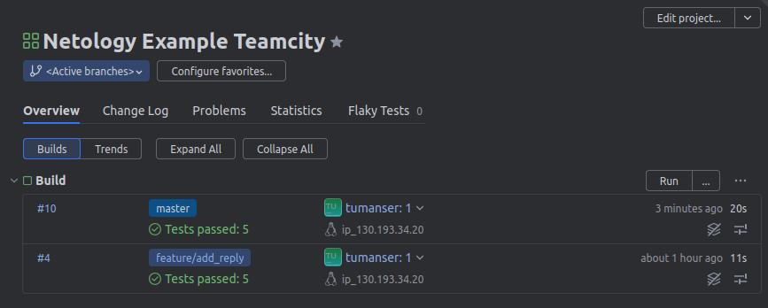
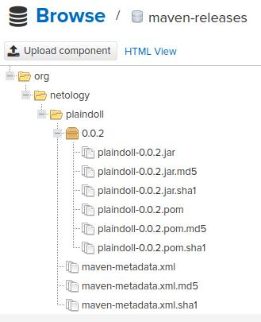
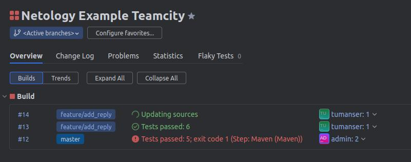
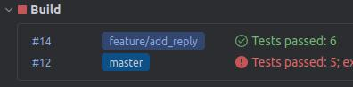

# Домашнее задание к занятию 11 «Teamcity»


## Подготовка к выполнению


> 1. В Yandex Cloud создайте новый инстанс (4CPU4RAM) на основе образа `jetbrains/teamcity-server`.
> 2. Дождитесь запуска teamcity, выполните первоначальную настройку.


https://hub.docker.com/r/jetbrains/teamcity-server

* Teamcity Server UI: http://<teamcity_url>:8111
* admin / admin123


> 3. Создайте ещё один инстанс (2CPU4RAM) на основе образа `jetbrains/teamcity-agent`. Пропишите к нему переменную окружения `SERVER_URL: "http://<teamcity_url>:8111"`.


https://hub.docker.com/r/jetbrains/teamcity-agent/

Переменную окружения указываем при создании ВМ, когда указываем образ.

В Temacity Server UI через некоторое время (~4 мин.) после старта ВМ агента в разделе `Unauthorized Agents` появится этот агент.
Там его и авторизуем.


> 6. Создайте VM (2CPU4RAM) и запустите [playbook](./infrastructure).


На `CentOS 7` playbook отрабатывает нормально.

Если используется `Fedora`, то нужны дополнения.

* Нужно установить ACL, иначе завалится шаг "Download Nexus":

    ```yml
        - name: Install ACL
          become: true
          package:
            name: [acl]
            state: present
    ```

* Отключаем SELinux, иначе не стартует Nexus:

    ```yml
        - name: Disable SELinux
          become: true
          shell: setenforce 0
    ```

* Nexus UI: http://<nexus_url>:8081
* admin / admin123


> 5. Сделайте fork [репозитория](https://github.com/aragastmatb/example-teamcity).


* Github: https://github.com/tundravarg/netology-example-teamcity


## Основная часть


> 1. Создайте новый проект в teamcity на основе fork.
> 2. Сделайте autodetect конфигурации.
> 3. Сохраните необходимые шаги, запустите первую сборку master.
> 4. Поменяйте условия сборки: если сборка по ветке `master`, то должен происходит `mvn clean deploy`, иначе `mvn clean test`.
> 5. Для deploy будет необходимо загрузить [settings.xml](./teamcity/settings.xml) в набор конфигураций maven у teamcity, предварительно записав туда креды для подключения к nexus.
> 6. В pom.xml необходимо поменять ссылки на репозиторий и nexus.
> 7. Запустите сборку по master, убедитесь, что всё прошло успешно и артефакт появился в nexus.







> 8. Мигрируйте `build configuration` в репозиторий.


Мигрировал в формате Kotlin.
Появился каталог `.teamcity` с настройками проекта.


> 9. Создайте отдельную ветку `feature/add_reply` в репозитории.
> 10. Напишите новый метод для класса Welcomer: метод должен возвращать произвольную реплику, содержащую слово `hunter`.
> 11. Дополните тест для нового метода на поиск слова `hunter` в новой реплике.
> 12. Сделайте push всех изменений в новую ветку репозитория.
> 13. Убедитесь, что сборка самостоятельно запустилась, тесты прошли успешно.






**NOTE**: Сборка master красная, т.к. на предыдущем шаге в master заливались конфиги Teamcity,
          что триггернуло сборку и публикацию артефакта в Nexus, где этот артефакт уже есть.
