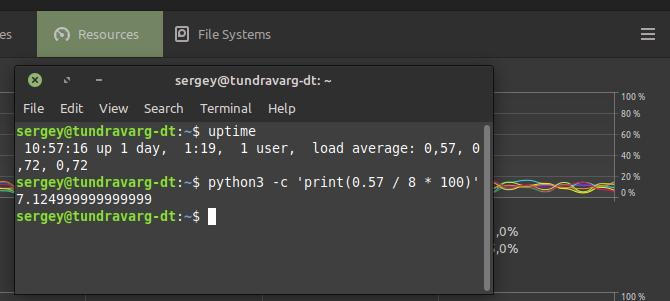

# Домашнее задание к занятию "13.Системы мониторинга"

> 1. Вас пригласили настроить мониторинг на проект. На онбординге вам рассказали, что проект представляет из себя 
платформу для вычислений с выдачей текстовых отчетов, которые сохраняются на диск. Взаимодействие с платформой 
осуществляется по протоколу http. Также вам отметили, что вычисления загружают ЦПУ. Какой минимальный набор метрик вы
выведите в мониторинг и почему?

* CPU
    * Это базовая метрика для любой системы.
    * Раз у нас сервис нагружает процессор, значит нам надо понимать, какая нагрузка приходится на каждый экземпляр.
        Может надо отмасштабировать систему.
* Оперативная память
    * Это базовая метрика для любой системы.
* Объём занятого/свободного пространства на разделе, куда сохраняются отчёты
    * Отчёты сохраняются на диск, значит надо мониторить занимаемый объём на разделе.
    * И кидать предупреждения о том, что близится предел.
* Отношение количества свободных и доступных inodes
    * Если наша система генерит большое количество файлов.
        Если это не так, то метрика эта будет лишней.
* Процент проваленных HTTP-запросов (возможно с разделением на 4xx и 5xx)
    * Раз идёт взаимодействие по HTTP, где достаточно понятно, что происходит по кодам ответов, то мониторить отношение успешных ответов к провальным было бы полезно.
    * Плюс общее количество поступающих запросов в единицу времени: может наша система пыхтит, дымит, парит не от полезной нагрузки, а от тонн запросов.

> 2. Менеджер продукта посмотрев на ваши метрики сказал, что ему непонятно что такое RAM/inodes/CPUla. Также он сказал, 
что хочет понимать, насколько мы выполняем свои обязанности перед клиентами и какое качество обслуживания. Что вы 
можете ему предложить?

* ~~Пойти погуглить...~~
* > RAM
    * Один из основных вычислительных ресурсов - оперативная память.
        Наши программы размещаются в ОП, переменные размещаются в ОП.
        Если доступная ОП закончится в результате некорректного дизайна приложения или утечки памяти, приложение упадёт и сервис станет недоступным.
        Можем дёшево нивелировать проблему за счёт swap-памяти на жёстком диске.
* > inodes
    * Каждый файл на жёстком диске помимо своего содержимого имеет некоторую мета-информацию: размер, владелец, группа, права доступа и др.
        Эта информация хранится в структуре файловой системы.
        Количество таких записей ограничено.
        И если, в нашей системе создаётся большое количество файлов (и каталогов тоже),
        то мы можем столкнуться с проблемой нехватки этих дескрипторов (inodes)
        даже при наличии большого объёма самих дисков.
* > CPUla
    * CPU load average - на сколько загружен процессор с учётом количества ядер и hyper-threading.
    * 
* > насколько мы выполняем свои обязанности перед клиентами и какое качество обслуживания
    * SLI (Service Level Indicator)
        * Наш сайт был доступен 99% времени за прошлый месяц.
        * 99% запросов были успешны ( (summ_2xx_requests + summ_3xx_requests) / (summ_all_requests) )
    * SLO (Service Level Objectives)
        * Задаём целевой показатель SLI.
        * Например, 95% успешных запросов. При SLI по этой метрике 99% - мы работаем весьма неплохо.
    * SLA (Service-Level Agreement)
        * Что случится если SLO не соблюдаются?
        * Наши обязательства и ответственность, прописанные в договоре с Потребителем.

> 3. Вашей DevOps команде в этом году не выделили финансирование на построение системы сбора логов. Разработчики в свою 
очередь хотят видеть все ошибки, которые выдают их приложения. Какое решение вы можете предпринять в этой ситуации, 
чтобы разработчики получали ошибки приложения?

* Если Сервис работает в OpenShif/Kubernetes, дать ответственным разработчикам права на просмотр статуса и логов подов Сервиса.
* Завести сервисный аккаунт для доступа разработчиков к стендам по SSH, чтобы они моглы смотреть логи напрямую.
* Написать приложение, которое будет периодически считывать логи и при обнаружении сообщений об ошибках, как-то сигнализировать разработчикам, например слать e-mail.
    * Такое себе... Дешевле запустить систему сбора логов.
