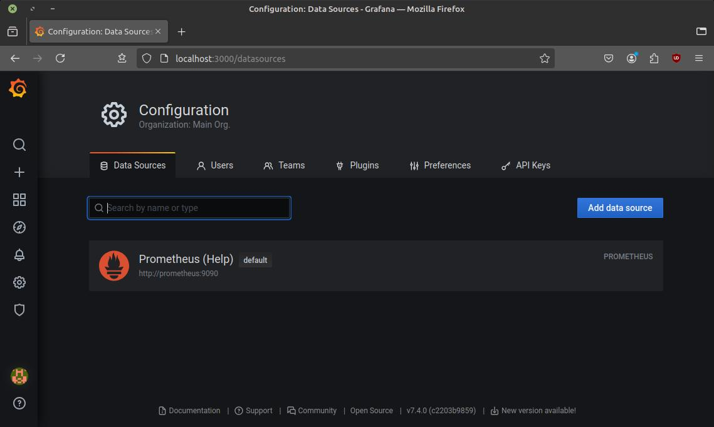
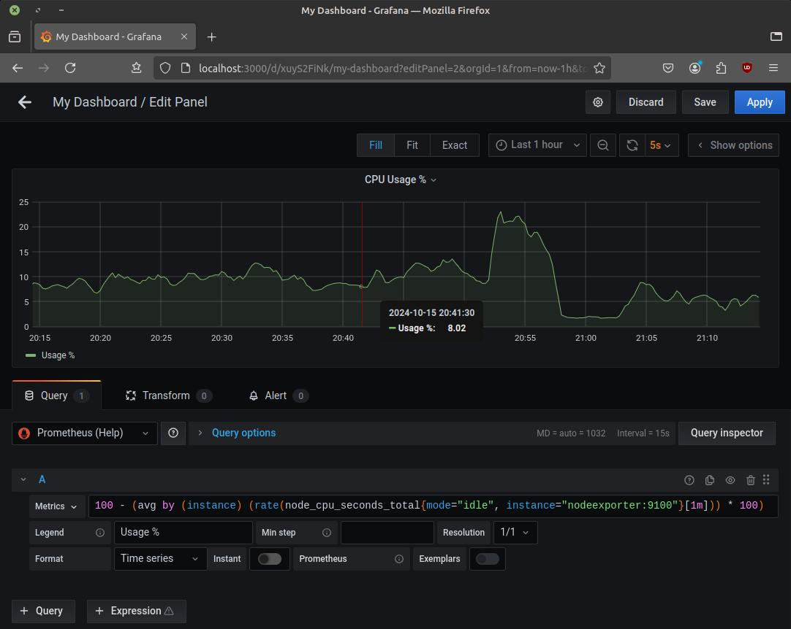
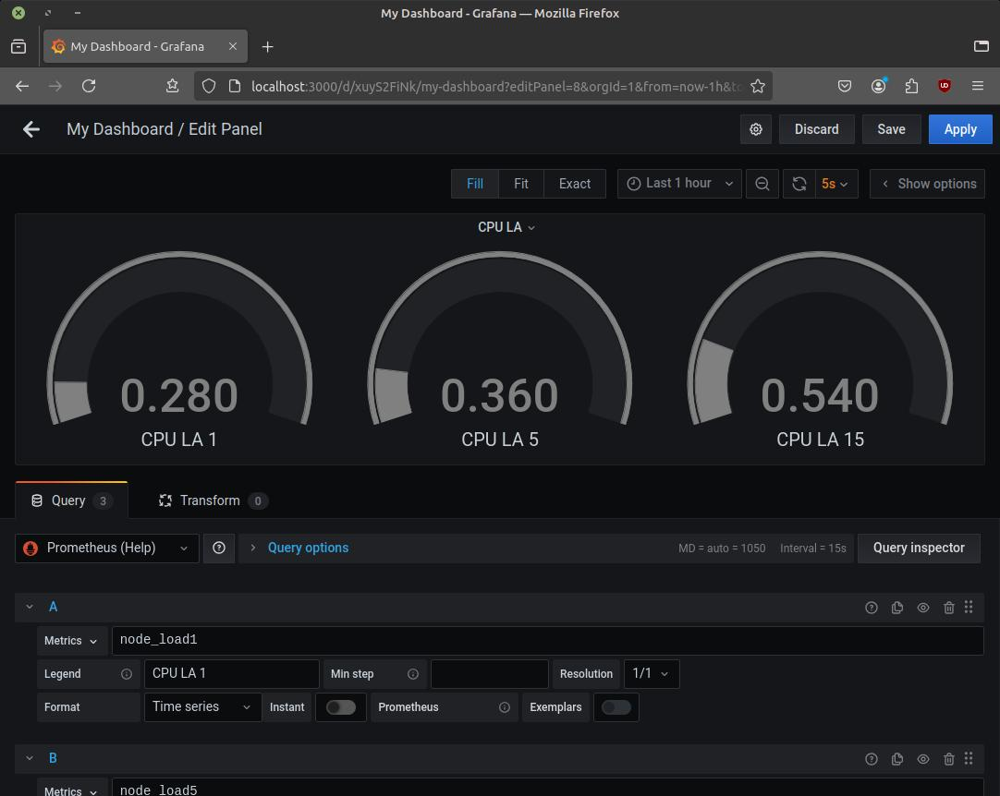
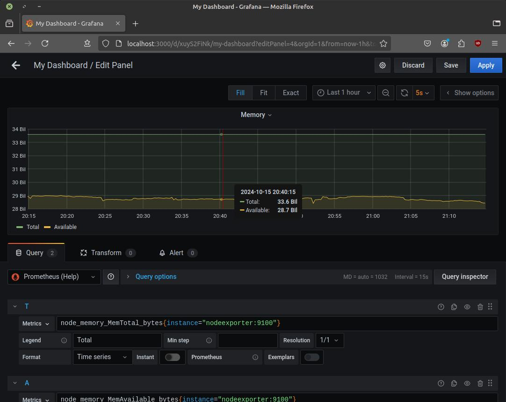
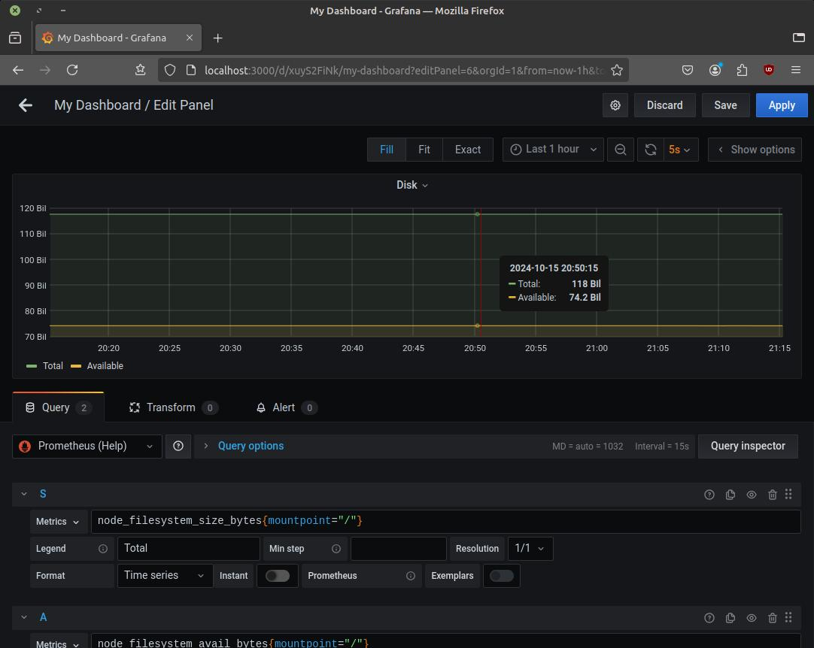
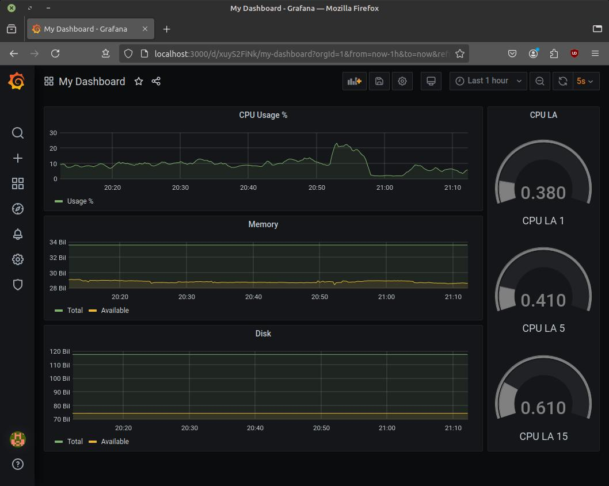
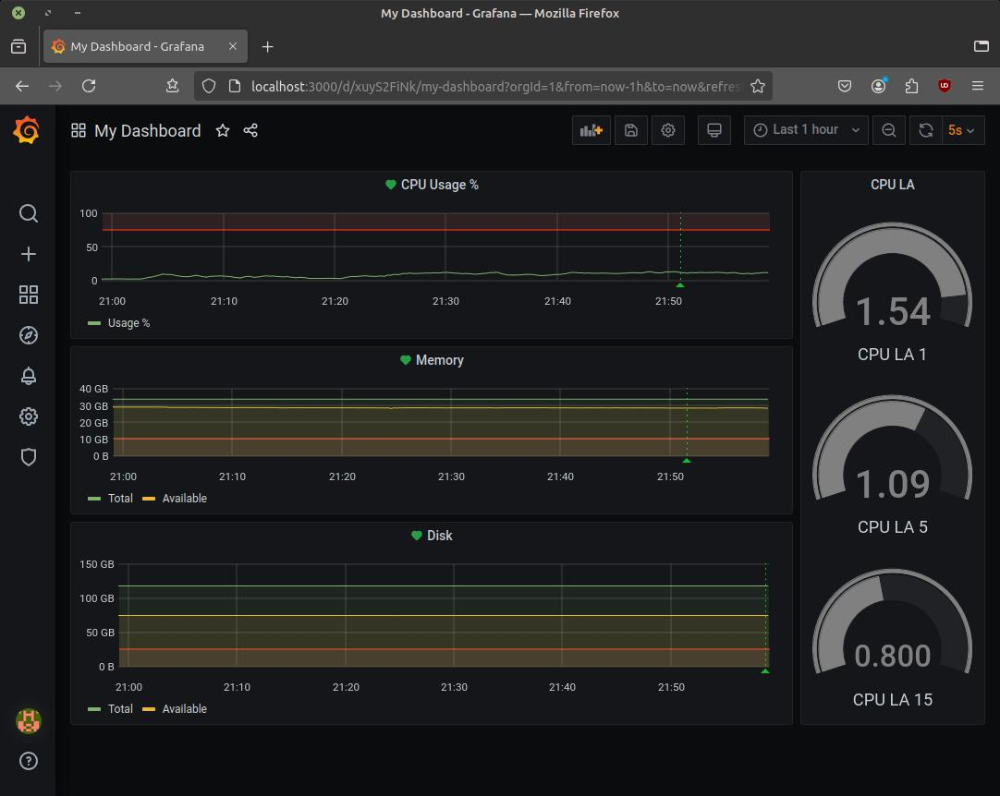

# Домашнее задание к занятию 14 «Средство визуализации Grafana»


## Обязательные задания


### Задание 1


> 1. Используя директорию [help](./help) внутри этого домашнего задания, запустите связку prometheus-grafana.
> 2. Зайдите в веб-интерфейс grafana, используя авторизационные данные, указанные в манифесте docker-compose.
> 3. Подключите поднятый вами prometheus, как источник данных.
> 4. Решение домашнего задания — скриншот веб-интерфейса grafana со списком подключенных Datasource.





### Задание 2


> Создайте Dashboard и в ней создайте Panels:


> - утилизация CPU для nodeexporter (в процентах, 100-idle);


```grafana
100 - (avg by (instance) (rate(node_cpu_seconds_total{mode="idle", instance="nodeexporter:9100"}[1m])) * 100)
```




> - CPULA 1/5/15;


```grafana
node_load1{instance="nodeexporter:9100"}
----
node_load5{instance="nodeexporter:9100"}
----
node_load15{instance="nodeexporter:9100"}
```




> - количество свободной оперативной памяти;


```grafana
node_memory_MemTotal_bytes{instance="nodeexporter:9100"}
----
node_memory_MemAvailable_bytes{instance="nodeexporter:9100"}
```




> - количество места на файловой системе.


```grafana
node_filesystem_size_bytes{mountpoint="/", instance="nodeexporter:9100"}
----
node_filesystem_avail_bytes{mountpoint="/", instance="nodeexporter:9100"}
```





> Для решения этого задания приведите promql-запросы для выдачи этих метрик, а также скриншот получившейся Dashboard.





## Задание 3


> 1. Создайте для каждой Dashboard подходящее правило alert — можно обратиться к первой лекции в блоке «Мониторинг».
> 2. В качестве решения задания приведите скриншот вашей итоговой Dashboard.



