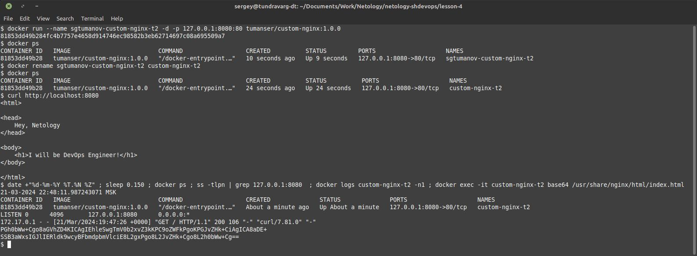

# Домашнее задание к занятию 4 «Оркестрация группой Docker контейнеров на примере Docker Compose»


## Задача 1


> Предоставьте ответ в виде ссылки на https://hub.docker.com/<username_repo>/custom-nginx/general.

https://hub.docker.com/repository/docker/tumanser/custom-nginx/general


## Задача 2


> В качестве ответа приложите скриншоты консоли, где видно все введенные команды и их вывод.

```shell
docker rm -f sgtumanov-custom-nginx-t2 custom-nginx-t2

docker run --name sgtumanov-custom-nginx-t2 -d -p 127.0.0.1:8080:80 tumanser/custom-nginx:1.0.0
docker ps
docker rename sgtumanov-custom-nginx-t2 custom-nginx-t2
docker ps
curl http://localhost:8080

echo -e "\n----\n"

date +"%d-%m-%Y %T.%N %Z" ; sleep 0.150 ; docker ps ; ss -tlpn | grep 127.0.0.1:8080  ; docker logs custom-nginx-t2 -n1 ; docker exec -it custom-nginx-t2 base64 /usr/share/nginx/html/index.html
```

Результат:


