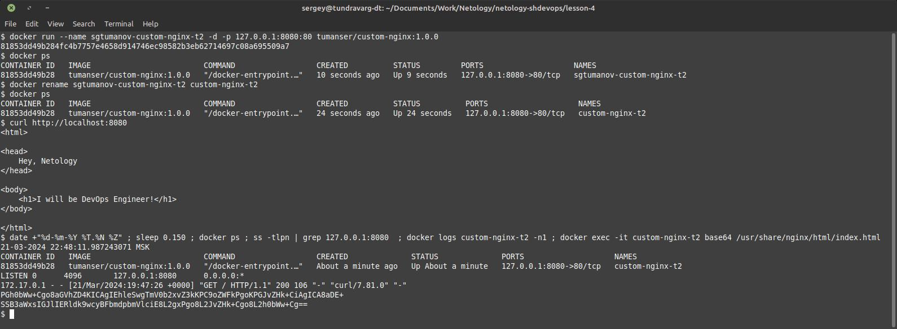
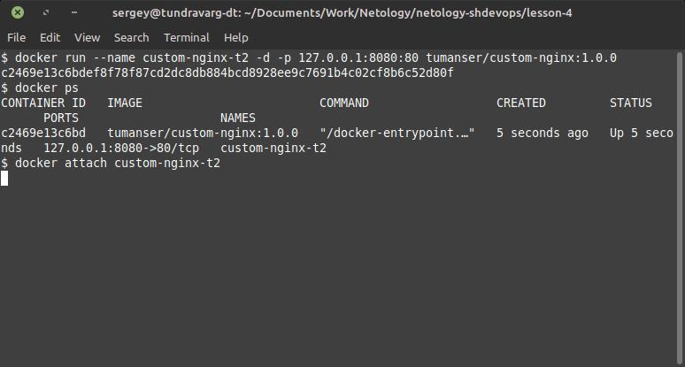
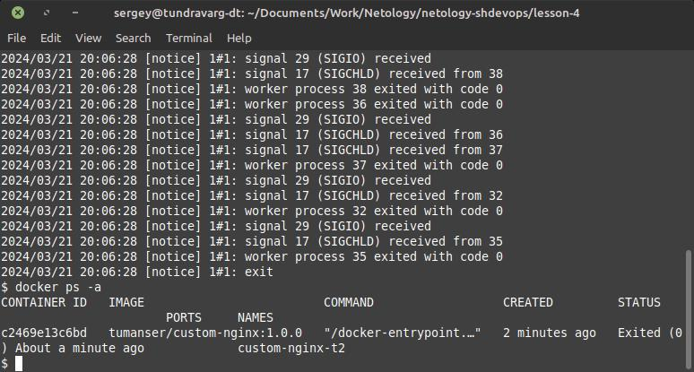
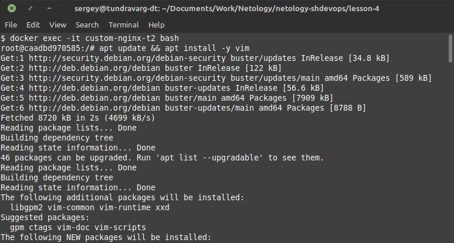
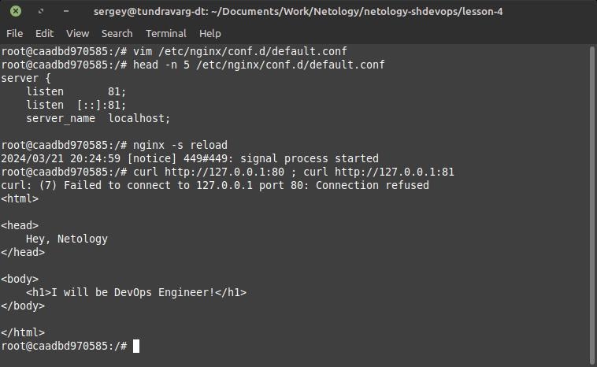
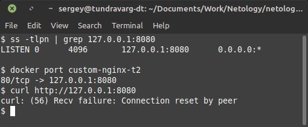
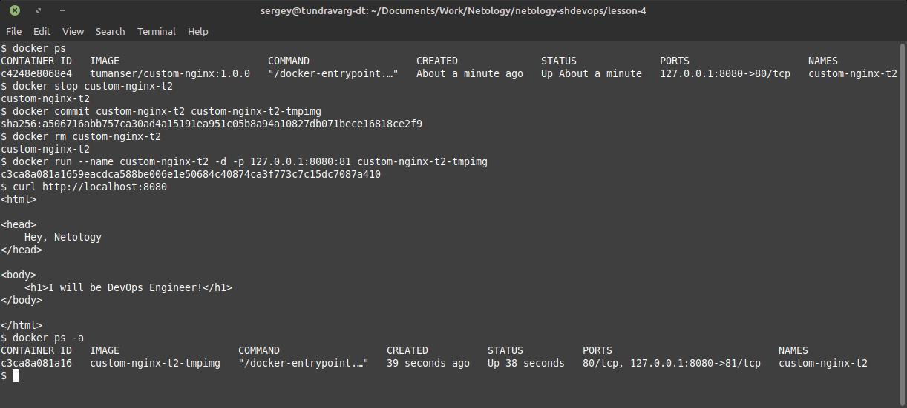

# Домашнее задание к занятию 4 «Оркестрация группой Docker контейнеров на примере Docker Compose»


## Задача 1


> Предоставьте ответ в виде ссылки на https://hub.docker.com/<username_repo>/custom-nginx/general.

https://hub.docker.com/repository/docker/tumanser/custom-nginx/general


## Задача 2


> В качестве ответа приложите скриншоты консоли, где видно все введенные команды и их вывод.

```shell
docker rm -f sgtumanov-custom-nginx-t2 custom-nginx-t2

docker run --name sgtumanov-custom-nginx-t2 -d -p 127.0.0.1:8080:80 tumanser/custom-nginx:1.0.0
docker ps
docker rename sgtumanov-custom-nginx-t2 custom-nginx-t2
docker ps
curl http://localhost:8080

echo -e "\n----\n"

date +"%d-%m-%Y %T.%N %Z" ; sleep 0.150 ; docker ps ; ss -tlpn | grep 127.0.0.1:8080  ; docker logs custom-nginx-t2 -n1 ; docker exec -it custom-nginx-t2 base64 /usr/share/nginx/html/index.html
```

Результат:




## Задача 3


## Подзадача 3-1


> ... объясните своими словами почему контейнер остановился.

```shell
docker container rm -f custom-nginx-t2
docker run --name custom-nginx-t2 -d -p 127.0.0.1:8080:80 tumanser/custom-nginx:1.0.0

docker attach custom-nginx-t2
docker ps -a
```





Контейнер остановился, т.к. при выпонении `docker attach` мы подключились к потокам ввода-вывода главного процесса контейнера,
а нажам Ctrl-C мы послали ему в stdin сигнал SIGINT, по которому процесс завершился.
Т.к. главный процесс контейнера завершился, то и контейнер остановился.


## Подзадача 3-2


> Отредактируйте файл "/etc/nginx/conf.d/default.conf", заменив порт "listen 80" на "listen 81".
> Кратко объясните суть возникшей проблемы.

```shell
docker container rm -f custom-nginx-t2
docker run --name custom-nginx-t2 -d -p 127.0.0.1:8080:80 tumanser/custom-nginx:1.0.0

docker exec -it custom-nginx-t2 bash

apt update && apt install -y vim
vim /etc/nginx/conf.d/default.conf
head -n 5 /etc/nginx/conf.d/default.conf

nginx -s reload
curl http://127.0.0.1:80 ; curl http://127.0.0.1:81

ss -tlpn | grep 127.0.0.1:8080
docker port custom-nginx-t2
curl http://127.0.0.1:8080

docker container rm -f custom-nginx-t2
```







Приложение внутри контейнера перестало слушать порт 80 и стало слушать порт 81, 
а сам контейнер продолжает слушать порт 80 хоста.
Соответственно коннект по порту 80 внутри контейнера просто не проходит (connection refused),
а со стороны хоста рвётся внутри контейнера (Connection reset by peer).


## Подзадача 3-3


> Попробуйте самостоятельно исправить конфигурацию контейнера, используя доступные источники в интернете. Не изменяйте конфигурацию nginx и не удаляйте контейнер. Останавливать контейнер можно.

```shell
docker stop custom-nginx-t2
docker commit custom-nginx-t2 custom-nginx-t2-tmpimg
docker rm custom-nginx-t2
docker run --name custom-nginx-t2 -d -p 127.0.0.1:8080:81 custom-nginx-t2-tmpimg
```



Да, конечно, исходный сломанный контейнер мы удалили,
но мы восстановили его внутреннее состояние через `docker commit` и перезапуск с новым биндингом.

Можно было ещё через "Reconfigure Docker in Flight".
Только зачем?
